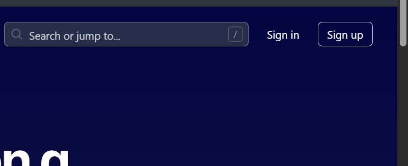
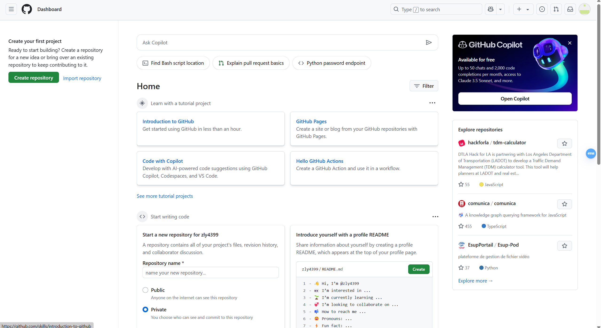
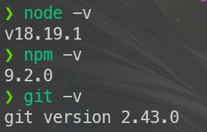

*考虑到很多人亟需一个自己的博客存放文章，特出此教程。*

<!-- more -->

# 注册账号

需要到[GitHub官网](https://github.com)注册一个自己的账号。GitHub国内访问不稳定（包括GitHub pages部署的博客），建议去下载一个watt toolkit或者自备一个魔法上网使用。



右上角的sign up点进去


在这按顺序填上自己的邮箱、准备设置的密码、以及用户名（只允许使用英文字母、数字以及“ - ”这个符号（也就是减号/连字符，连字符不能为第一个字符））

给一个示例：

| Email |
| :-- |
| example.Example.com |
| Password |
| PASSWORD |
| Username |
| user-name114514 |

填好后点Continue

然后会进行人机验证，过一下就行

之后会向你刚刚填写的这个邮箱上发验证码，填上去

完成后可能会跳转回官网主页，让你再登录一次


点sign in，然后输入刚刚注册时候用的邮箱密码登录。



这里就登录成功了。

github pages有很多配置方法，这里用我常用的hexo来配置，因为主题很多，而且用着比较熟悉。

# 本地环境配置

先下载node.js和git。

- Node.js：[https://nodejs.org/zh-cn](https://link.zhihu.com/?target=https://nodejs.org/zh-cn)
- Git：[[https://git-scm.com/downloads](https://git-scm.com/downloads)

下载 Node.js 和 Git 程序并安装，一路点 “下一步” 按默认配置完成安装。

安装完成后，Win+R 输入 cmd 并打开，依次输入 `node -v`、`npm -v` 和 `git --version` 并回车，如下图出现程序版本号即可。



# 常用命令

```
hexo new "name"       # 新建文章
hexo new page "name"  # 新建页面
hexo g                # 生成页面
hexo d                # 部署
hexo g -d             # 生成页面并部署
hexo s                # 本地预览
hexo clean            # 清除缓存和已生成的静态文件
hexo help             # 帮助
```

# 常见问题

1. Hexo 设置显示文章摘要，首页不显示全文

Hexo 主页文章列表默认会显示文章全文，浏览时很不方便，可以在文章中插入 `<!--more-->` 进行分段。

该代码前面的内容会作为摘要显示，而后面的内容会替换为 “Read More” 隐藏起来。


2. 设置网站图标

进入 themes/主题 文件夹，打开 \_config.yml 配置文件，找到 favicon 修改，一般格式为：`favicon: 图标地址`。（不同主题可能略有差别）

3. 修改并部署后没有效果

使用 `hexo clean` 清理后重新部署。

4. 开启 HTTPS 后访问网站显示连接不安全？

证书还未部署生效，等待一会儿，清除浏览器缓存再试。

5. Mac 安装 Hexo 报错无法安装

Mac 用户需要管理员权限运行，使用 `sudo npm install -g hexo-cli` 命令安装。

6. npm 下载速度慢，甚至完全没反应

使用 npm 安装程序等待很久也没反应，或者下载速度很慢，可以更换 npm 源为国内 npm 镜像。
