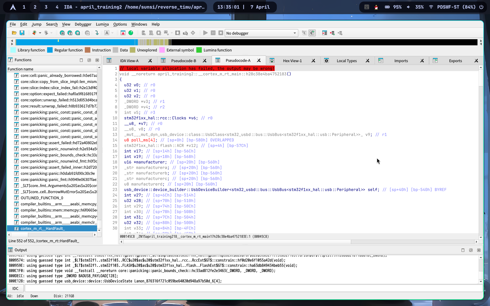
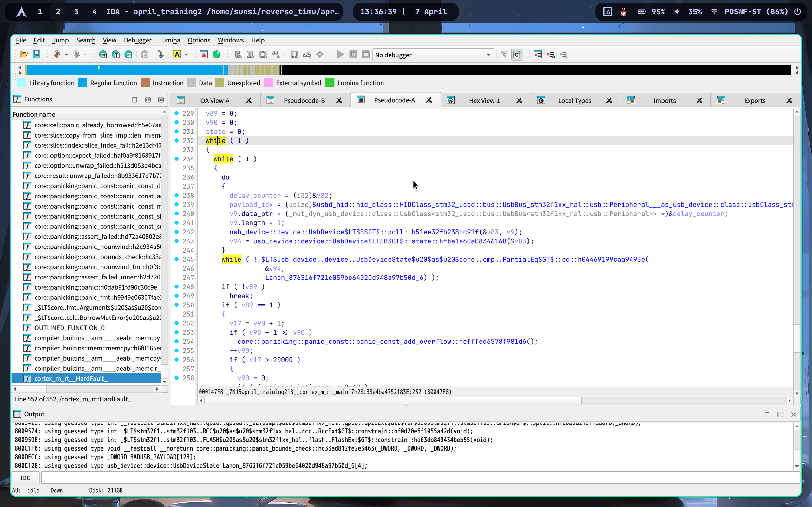
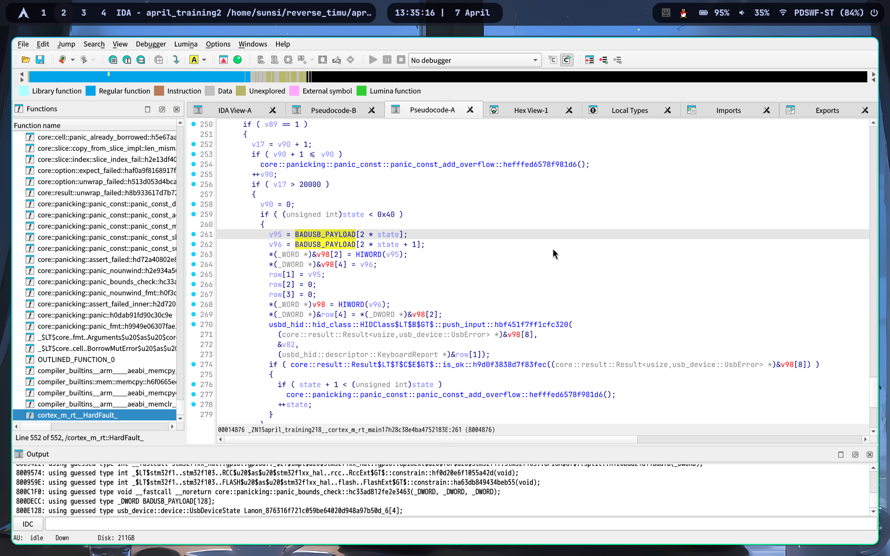
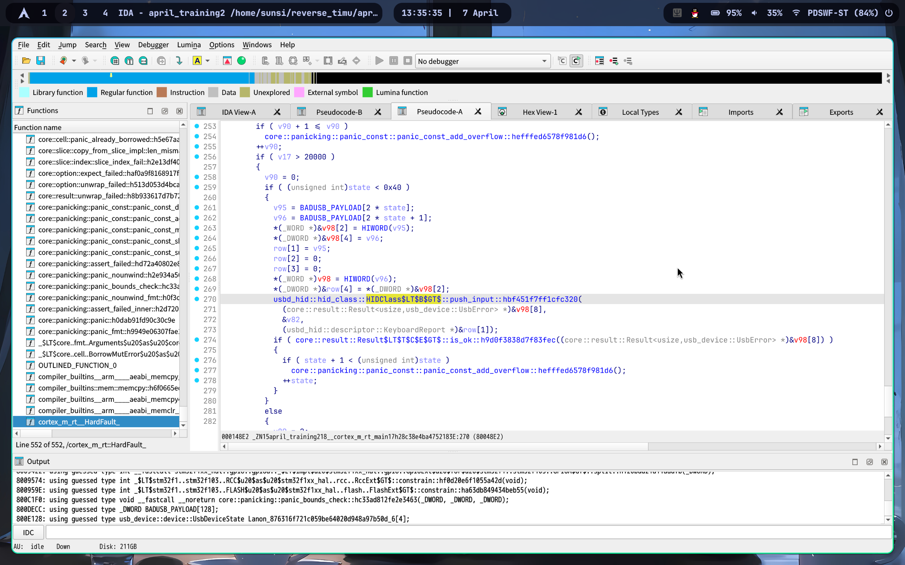
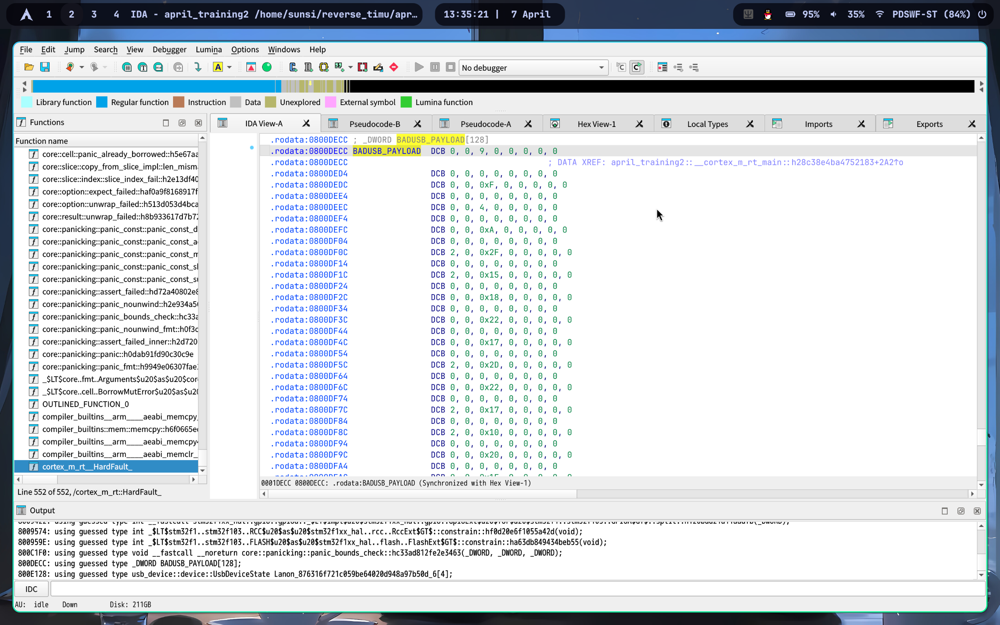

笔自己画画.gif


赛后再完善本文。

---

一直拖到五一才想起来写这篇文章。

简单阐述一下这道题：我用stm32f103c8t6，结合stm32f1xx-hal等crate，做了一个插上电脑就能通过blue pill板子上usb口模拟键盘在电脑上按出flag的程序。所以理论上如果选手手头有blue pill板子的话，是可以把程序烧进去插电脑上直接试出来的。

```rust
#![no_std]
#![no_main]

use cortex_m_rt::entry;
use panic_halt as _;
use stm32f1xx_hal::{
    pac,
    prelude::*,
    usb::{Peripheral, UsbBus, UsbBusType},
};
use usb_device::prelude::*;
use usbd_hid::{
    descriptor::{KeyboardReport, SerializedDescriptor},
    hid_class::HIDClass,
};

// 核心考点：这是 BadUSB 的 Payload，包含了 HID Keycode
// #[no_mangle] 和 #[used] 确保这段数据原封不动地保留在 ELF 文件的 .rodata 段中
#[unsafe(no_mangle)]
#[used]
static BADUSB_PAYLOAD: [[u8; 8]; 64] = [
    [0x00, 0x00, 0x09, 0x00, 0x00, 0x00, 0x00, 0x00], // f
    [0x00, 0x00, 0x00, 0x00, 0x00, 0x00, 0x00, 0x00], // Release
    [0x00, 0x00, 0x0F, 0x00, 0x00, 0x00, 0x00, 0x00], // l
    [0x00, 0x00, 0x00, 0x00, 0x00, 0x00, 0x00, 0x00], // Release
    [0x00, 0x00, 0x04, 0x00, 0x00, 0x00, 0x00, 0x00], // a
......
    [0x00, 0x00, 0x00, 0x00, 0x00, 0x00, 0x00, 0x00], // Release
    [0x00, 0x00, 0x1A, 0x00, 0x00, 0x00, 0x00, 0x00], // w
    [0x00, 0x00, 0x00, 0x00, 0x00, 0x00, 0x00, 0x00], // Release
    [0x00, 0x00, 0x21, 0x00, 0x00, 0x00, 0x00, 0x00], // 4
    [0x00, 0x00, 0x00, 0x00, 0x00, 0x00, 0x00, 0x00], // Release
    [0x00, 0x00, 0x15, 0x00, 0x00, 0x00, 0x00, 0x00], // r
    [0x00, 0x00, 0x00, 0x00, 0x00, 0x00, 0x00, 0x00], // Release
    [0x00, 0x00, 0x20, 0x00, 0x00, 0x00, 0x00, 0x00], // 3
    [0x00, 0x00, 0x00, 0x00, 0x00, 0x00, 0x00, 0x00], // Release
    [0x02, 0x00, 0x30, 0x00, 0x00, 0x00, 0x00, 0x00], // }
    [0x00, 0x00, 0x00, 0x00, 0x00, 0x00, 0x00, 0x00], // Release
];

#[entry]
fn main() -> ! {
    // 1. 获取外设句柄
    let dp = pac::Peripherals::take().unwrap();
    let mut flash = dp.FLASH.constrain();
    let rcc = dp.RCC.constrain();

    // 2. 配置时钟：USB 必须要求 48MHz 的频率
    // BluePill 通常有一个 8MHz 的外部晶振 (HSE)
    #[allow(unused)]
    let clocks = rcc
        .cfgr
        .use_hse(8.MHz())
        .sysclk(48.MHz())
        .pclk1(24.MHz())
        .freeze(&mut flash.acr);

    let mut gpioa = dp.GPIOA.split();

    // 3. 强制主机重新枚举 USB 设备 (BluePill 特有做法)
    // 拉低 PA12(DP) 一小段时间，让电脑认为设备被拔出后重新插入
    let mut usb_dp = gpioa.pa12.into_push_pull_output(&mut gpioa.crh);
    usb_dp.set_low();
    cortex_m::asm::delay(8_000_000); // 约 100~200ms 的延迟

    let usb_dm = gpioa.pa11;
    let usb_dp = usb_dp.into_floating_input(&mut gpioa.crh);

    let usb = Peripheral {
        usb: dp.USB,
        pin_dm: usb_dm,
        pin_dp: usb_dp,
    };

    // 4. 初始化 USB 总线和 HID 接口
    static mut EP_MEMORY: [u32; 1024] = [0; 1024];
    let usb_bus = UsbBus::new(usb);

    // 初始化为键盘设备
    let mut hid = HIDClass::new(&usb_bus, KeyboardReport::desc(), 10);

    // 设置 USB 描述符
    let mut usb_dev = UsbDeviceBuilder::new(&usb_bus, UsbVidPid(0x16c0, 0x27db))
        .manufacturer("CTF Maker")
        .product("Ghost Typist")
        .serial_number("1337")
        .device_class(0)
        .build();

    // 5. 状态机：0=等待识别, 1=输入Payload, 2=结束
    let mut state = 0;
    let mut delay_counter = 0;
    let mut payload_idx = 0;

    // 6. 主循环
    loop {
        // 让 USB 栈处理中断和通信 (非阻塞)
        if !usb_dev.poll(&mut [&mut hid]) {
            // poll 返回 false 也要继续执行下方的状态机逻辑
        }

        // 当 USB 枚举成功，准备就绪后
        if usb_dev.state() == UsbDeviceState::Configured {
            if state == 0 {
                // 插上电脑后延迟一会，给系统反应时间加载驱动
                delay_counter += 1;
                if delay_counter > 500_000 {
                    state = 1;
                    delay_counter = 0;
                }
            } else if state == 1 {
                // 模拟人类打字的间隔
                delay_counter += 1;
                if delay_counter > 20_000 {
                    delay_counter = 0;

                    if payload_idx < BADUSB_PAYLOAD.len() {
                        let row = BADUSB_PAYLOAD[payload_idx];

                        // 组装键盘报告
                        let report = KeyboardReport {
                            modifier: row[0],
                            reserved: 0,
                            leds: 0,
                            keycodes: [row[2], row[3], row[4], row[5], row[6], row[7]],
                        };

                        // 尝试发送，如果上一次的发送还没完成会返回 Err，忽略即可，下一轮再试
                        if hid.push_input(&report).is_ok() {
                            payload_idx += 1;
                        }
                    } else {
                        // 输入完毕，进入挂起状态
                        state = 2;
                    }
                }
            }
        }
    }
}

```

所以只要分析出来HID描述符，基本就能秒杀这道题。

flag：flag{Ru5t_5TM32_B4dUSB_H4rdw4r3}
writeup：
一个STM32固件，用IDA打开。


依旧rust特有的鬼画符函数。但是不慌：任何单片机固件的核心都是一个死循环。所以我们找到这个死循环即可。



这里就是死循环。我们往下翻找能看到一个名为BADUSB_PAYLOAD的数组常量。



还有usbhid相关的库函数。说明这个固件是一个USBHID设备的固件。那想必这个PAYLOAD里一定塞的有什么内容了。



我们进入BADUSB_PAYLOAD一探究竟。




关于USB HID键盘报告描述符，可见[这篇文章](https://blog.csdn.net/UnsicentificLLLL/article/details/132040726)，关于HID键码，可以参考[这篇文章](https://github.com/tmk/tmk_keyboard/wiki/USB:-HID-Usage-Table)

不过如果你要是有STM32F103C8T6核心板的话，可以直接把这个程序烧录进去，然后插电脑上就可以拿到flag了（逃）

于是我们就可以根据报告描述符和HID键码，解析出flag了。flag{Ru5t_5TM32_B4dUSB_H4rdw4r3}