# CATCTF 2024 部分题 Writeup

<!-- more -->

## 流量分析

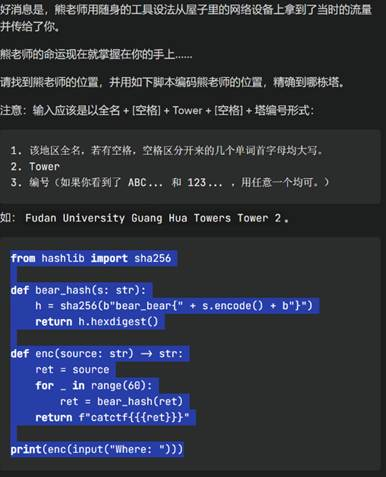

题干。  
这是道流量分析+社工题

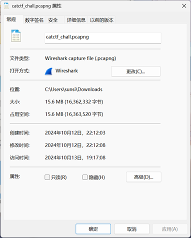

看一下文件大小，发现不小。推测里面可能包含的有一个或多个比较大的文件。  
首先用wireshark看一下流量包。

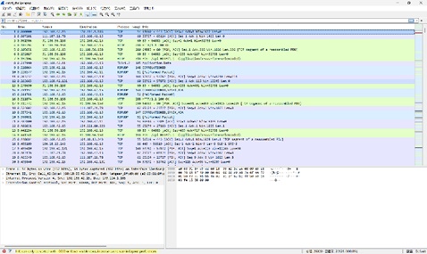

内容相当的杂乱。不过鉴于这个流量包比较大，我们可以用一种比较曲线救国的方法找一下大文件。  
利用wireshark中统计菜单的会话选项。

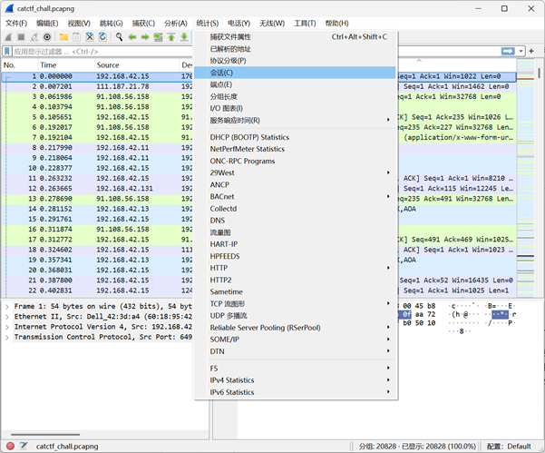

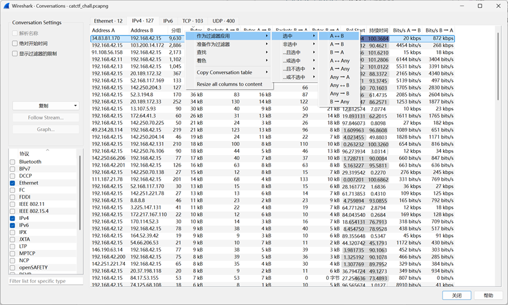

进到ipv4页，让Byte列从大到小排列一下，找到一个11MB的东西。将它过滤出来。  
往下翻一下，发现从16600多帧开始，传了一堆长度为2048的数据包。

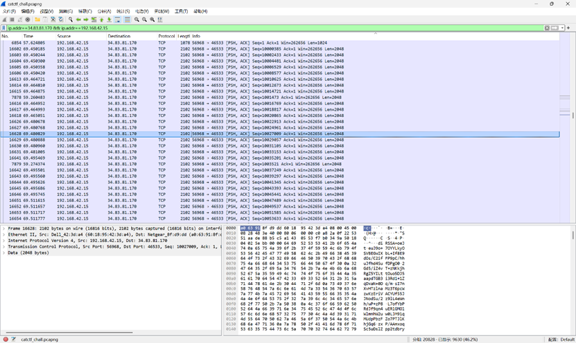

追踪一下。发现了一堆base64编码过的数据，目测应该是一张图片。

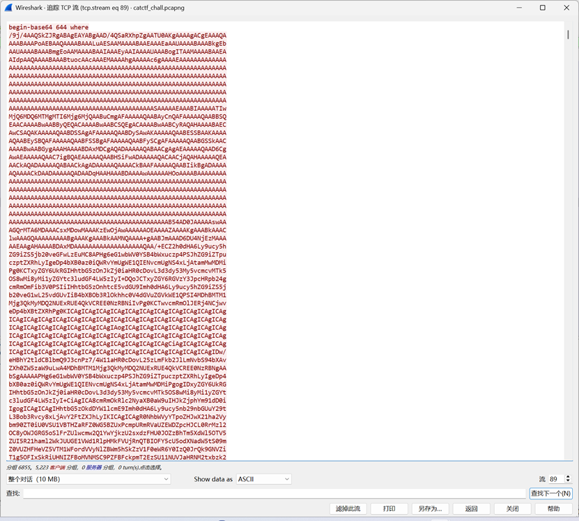

内容导出来。导出的文件中有很多换行。我们先把第一行那些无关内容删掉，然后在网上找个工具把所有换行删掉，得到这么一坨东西。

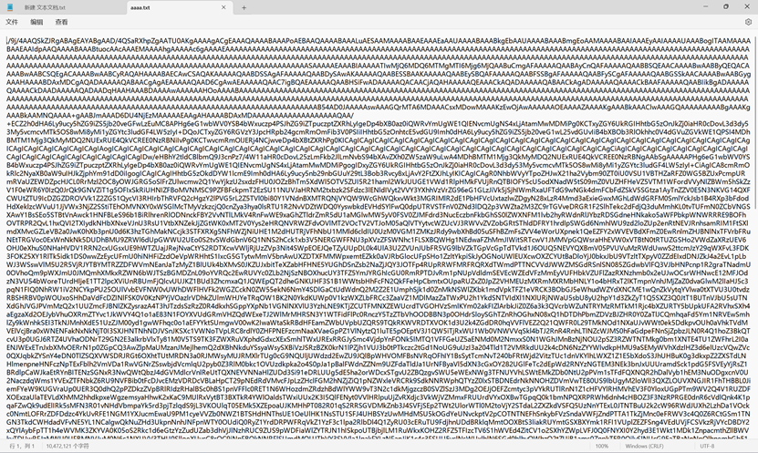

我们写个python 脚本把它转换成图片。

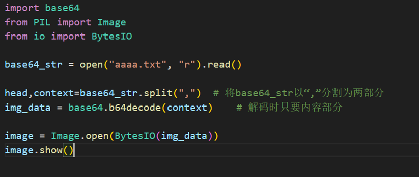

得到解码后的图片，我们拿到搜图网站搜一下这个地方在哪里。（这里笔者用的是谷歌搜图。）

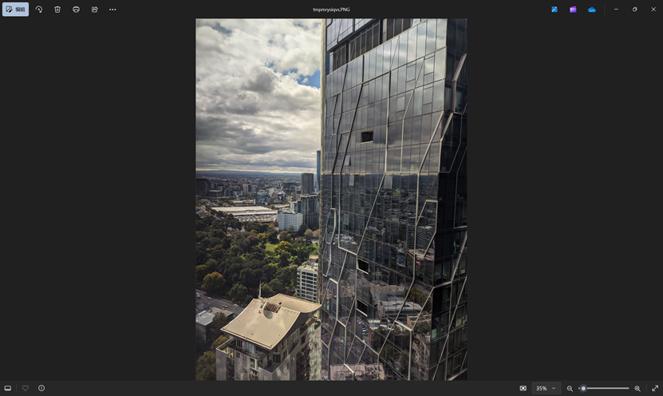


在这。看下地图。


Where应该是West Side Place Tower B。输到脚本里，得到flag。  
catctf\{1993f898114407c8aee9993e44efb6662c0fae268d5abb0645ff87041e3dbea0\}\*

##### \*注：由于这个题被发题老哥做过，不确定真正的flag到底是什么。但是思路是大差不差的。

## RADIO

音频文件，播放一下。  
乍一听很刺耳，但是接触无线电的老哥这会一定兴奋了。（或许有的老哥直接人肉解码，脑子里已经出画面了）这是sstv，是一种用音频传输图像的技术。  
我们重新播放一下\*，找个软件解码转成图片。

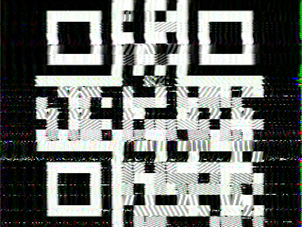

得到一张二维码。尝试扫描读取，发现不能解码。考虑这个radio音频文件有双声道。  
扔进audition，发现确实是双声道音频。我们放大点大概看一下频谱图，发现左右声道不相似。于是猜测两个声道分别对应了两个不同的二维码，或者是其他图片。  
分别播放两个声道\*，用软件解一下，解出来两个二维码。  
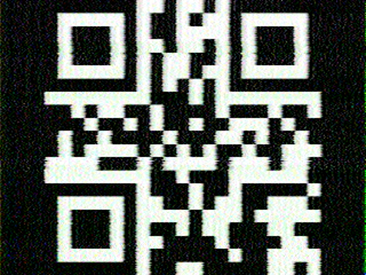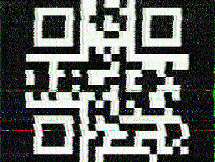  
这时我们尝试解码，成功解出来两个信息。  
右声道对应的为：catctf\{S5tv\_is\_  
左声道对应的为：coOL\_UNd\_SUP3r\}  
拼合一下，得到flag。  
catctf\{S5tv\_is\_ coOL\_UNd\_SUP3r\}  
\*注：不要尝试在夜深人静的寝室里放音频解码，会被暴打（）

## DOCX

这是个docx文档。按照题目暗示，我们把docx当成压缩包解压一下。（docx本质上就是个比较特殊的压缩包）  
解压好后，我们扫一下文件夹里的所有内容。

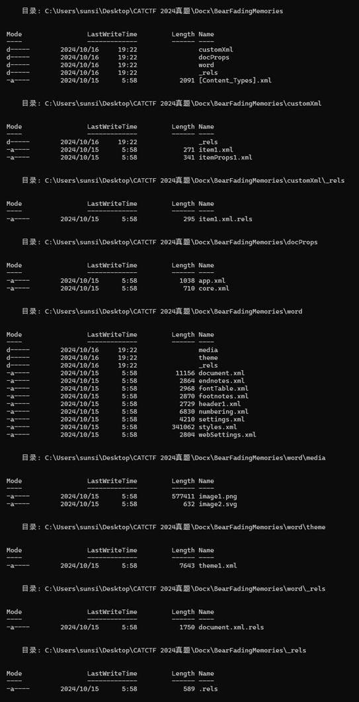

注意到，在.\\word\\media这个目录下存在一个png文件。我们用winhex打开，看一下有没有在文件尾部写入的有什么东西。

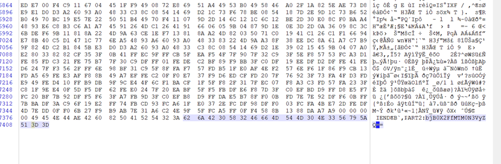

可以看到，在尾部确实插入了一些东西。根据前面PART2的提示，这提示我们这些东西对应的是flag的第二部分。这里用的是base64加密，我们把它复制下来，拿到cyberchef里解密一下。

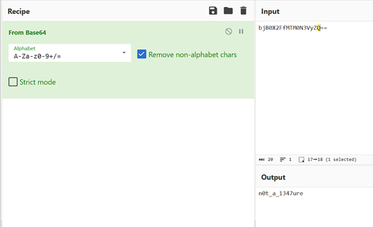

解密成功。第二部分：n0t\_a\_1347ure  
我们再来找找哪里还有剩余几个部分。根据题目暗示，我们看一下上一级目录下document.xml的内容。  
搜索一下PART关键字，在文档下三分之一处找到了第三部分的内容。同样地，我们复制下来，到cyberchef里解密。  
这里配置为：反向（Reverse）→From Base32，梭哈一下，成功解密。

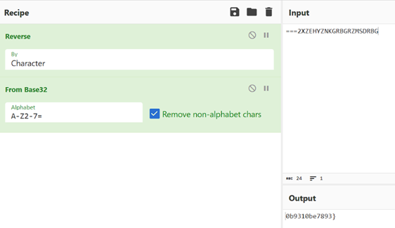

第三部分：0b9310be7893\}  
继续寻找。在同目录下header1.xml中找到了第一部分。同样地，我们拿到cyberchef解密。我们使用from hex。

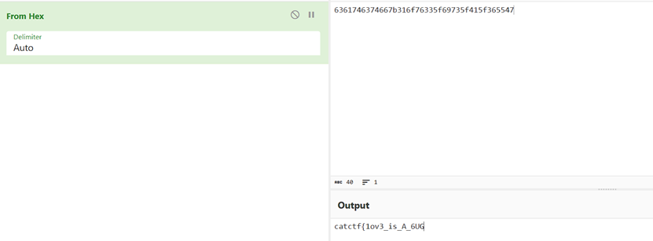

解密成功。第一部分：catctf\{1ov3\_is\_A\_6UG  
我们把得到的三段用“-”拼起来，即可得到flag。  
catctf\{1ov3\_is\_A\_6UG-n0t\_a\_1347ure-0b9310be7893\}

## LeNet

这是个典型的LeNet模型。压缩包里给出了model.py、训练好的pth和flag测试集。  
先让模型跑起来，能够复现题干内容。不会写，丢给AI写一个。

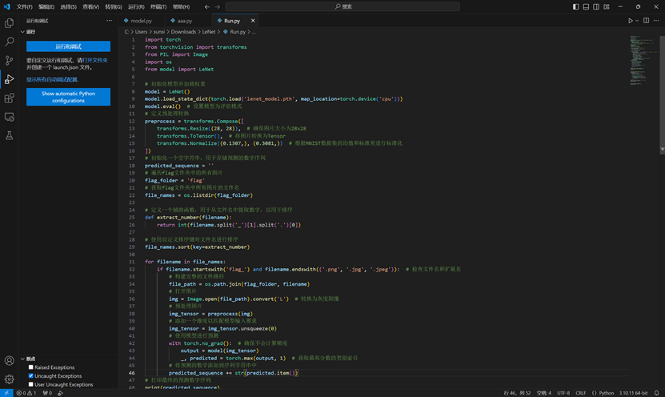

复现出来了。我们按照从flag\_0.jpg到flag\_129.jpg的顺序将每张图所识别出来的数字拼一块，组成一个超长的字符串，然后转成整型，再转为hex后转成字符串。

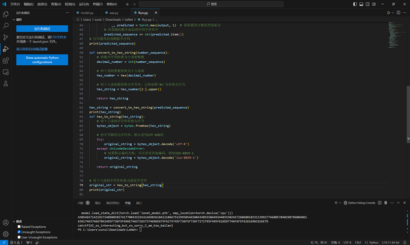

运行一下，成功得到flag。  
catctf\{AI\_so\_interesting\_but\_so\_sorry\_I\_am\_too\_bailan\}  
附解题脚本

```python
import torch
from torchvision import transforms
from PIL import Image
import os
from model import LeNet

# 初始化模型并加载权重
model = LeNet()
model.load_state_dict(torch.load('lenet_model.pth', map_location=torch.device('cpu')))
model.eval()  # 设置模型为评估模式
# 定义预处理转换
preprocess = transforms.Compose([
    transforms.Resize((28, 28)),  # 确保图片大小为28x28
    transforms.ToTensor(),  # 将图片转换为Tensor
    transforms.Normalize((0.1307,), (0.3081,))  # 根据MNIST数据集的均值和标准差进行标准化
])
# 初始化一个空字符串，用于存储预测的数字序列
predicted_sequence = ''
# 遍历flag文件夹中的所有图片
flag_folder = 'flag'
# 获取flag文件夹中所有图片的文件名
file_names = os.listdir(flag_folder)

# 定义一个辅助函数，用于从文件名中提取数字，以用于排序
def extract_number(filename):
    return int(filename.split('_')[1].split('.')[0])

# 使用自定义排序键对文件名进行排序
file_names.sort(key=extract_number)

for filename in file_names:
    if filename.startswith('flag_') and filename.endswith(('.png', '.jpg', '.jpeg')):  # 检查文件名和扩展名
        # 构建完整的文件路径
        file_path = os.path.join(flag_folder, filename)
        # 打开图片
        img = Image.open(file_path).convert('L')  # 转换为灰度图像
        # 预处理图片
        img_tensor = preprocess(img)
        # 添加一个维度以匹配模型输入要求
        img_tensor = img_tensor.unsqueeze(0)
        # 使用模型进行预测
        with torch.no_grad():  # 确保不会计算梯度
            output = model(img_tensor)
            _, predicted = torch.max(output, 1)  # 获取最高分数的类别索引
        # 将预测的数字添加到序列字符串中
        predicted_sequence += str(predicted.item())
# 打印最终的预测数字序列
print(predicted_sequence)

def convert_to_hex_string(number_sequence):
    # 将数字序列转换为十进制整数
    decimal_number = int(number_sequence)
    
    # 将十进制整数转换为十六进制
    hex_number = hex(decimal_number)
    
    # 将十六进制数转换为字符串，去掉前缀'0x'并转换为大写
    hex_string = hex_number[2:].upper()
    
    return hex_string

hex_string = convert_to_hex_string(predicted_sequence)
print(hex_string)
def hex_to_string(hex_string):
    # 将十六进制字符串转换为字节
    bytes_object = bytes.fromhex(hex_string)
    
    # 将字节解码为字符串，默认使用UTF-8编码
    try:
        original_string = bytes_object.decode('utf-8')
    except UnicodeDecodeError:
        # 如果默认编码失败，可以尝试其他编码，例如ISO-8859-1
        original_string = bytes_object.decode('iso-8859-1')
    
    return original_string

# 将十六进制字符串转换为原始字符串
original_str = hex_to_string(hex_string)
print(original_str)
```
