## 出题动机：
本意是打算出一个仿真题的，逆一个激活码算法。逆出来算法之后就可以结合机器码来算激活码，进而通过程序来请求获取flag了。

给的环境有一个远程靶机，一个本地激活客户端。远程靶机有一个web页面，但是在这肯定获取不了激活码的。毕竟想一想：作为一名黑客，在并没有购买厂商软件的情况下，厂商不可能会把你的机器码（也可能是其他特征数据）存放在自家验证服务器上，对吧？

给了一个漏洞点：通过激活软件提交的激活请求是完全不经过数据库比对的，只比对发来的机器码信息与算出的激活码对不对。这便是本题的一大突破口。


## WriteUp:

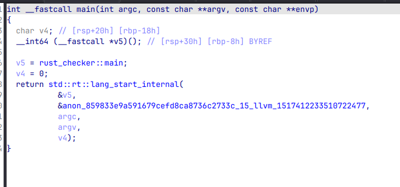

ida9对rust支持已经比较友好了。可以发现，v5对应的就是rust的main函数。跟进。

依旧rust特有的鬼画符主函数。不用看这部分，我们直接搜索index.html，为什么这样想？

因为程序是tauri做的，看程序图标就能看出来。tauri是前后端分离，而前端用什么写自然就不必多说了。

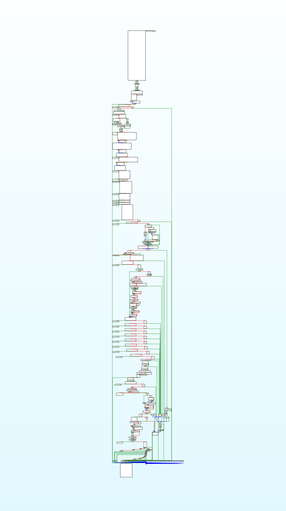

找到好几个字符串，一个个查找，找到这个部分

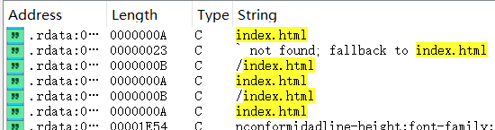

很明显的结构
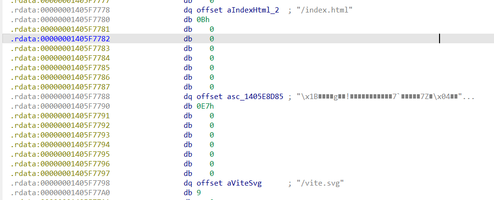

将二进制数据提取出来放入br文件，然后进行Brotli解压，得到index.html的内容
```HTML
<!doctype html>
<html lang="en">
  <head>
    <meta charset="UTF-8" />
    <link rel="icon" type="image/svg+xml" href="/vite.svg" />
    <meta name="viewport" content="width=device-width, initial-scale=1.0" />
    <title>Tauri + React + Typescript</title>
    <script type="module" crossorigin src="/assets/index-DGCiB7OF.js"></script>
    <link rel="stylesheet" crossorigin href="/assets/index-DJErgufo.css">
  </head>
  <body>
    <div id="root"></div>
  </body>
</html>
```


可以看到加载了关键文件index-DGCiB7OF.js，前端的内容都在该文件中，回去可以看到该文件和刚刚提取出来的文件index.html下面一点位置

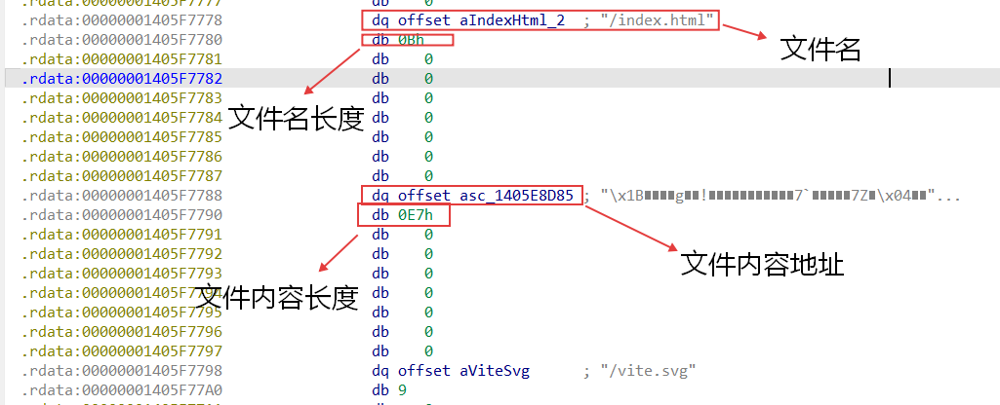

同样提取出来解压可以得到该文件的混淆内容，但是js混淆是编译时候的正常现象
你如果不想去混淆可以直接让ai分析一下，可以知道js文件是用来进行本地验证。如果本地通过，再进行远程服务器验证。
而本地验证的文件是verify_local，查找字符串

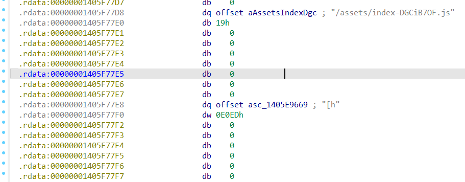

找到一个verify_local字符串，跟过去看看。

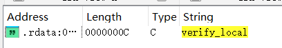

依旧弯弯绕绕看不懂，不过看到了一些特别的东西：IsDebuggerPresent函数，以及出现的几个aSpringctf2026s。同时注意到有一个函数引用过aSpringctf2026s这个字符串的切片。
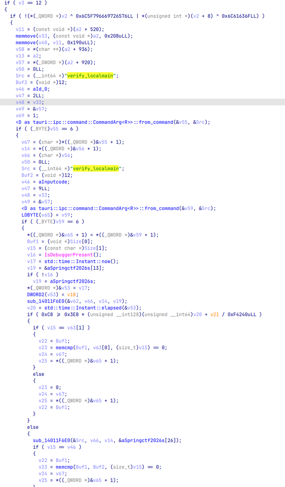

既然这么严防死守，那看来这里肯定有我们想要的东西了。这个sub_14011F6E0函数很可疑，我们跟进去看一看，同时也别忘了把这个字符串提出来。
aSpringctf2026s db 'SpringCTF2026Spr1ngCTF2O26SpringCTF2O2600:00:00:00:00:00'
提取时还注意到一个特别的字符串
a0123456789abcd db '0123456789ABCDEFGHIJKLMNOPQRSTUVWXYZ'，一起提取出来。

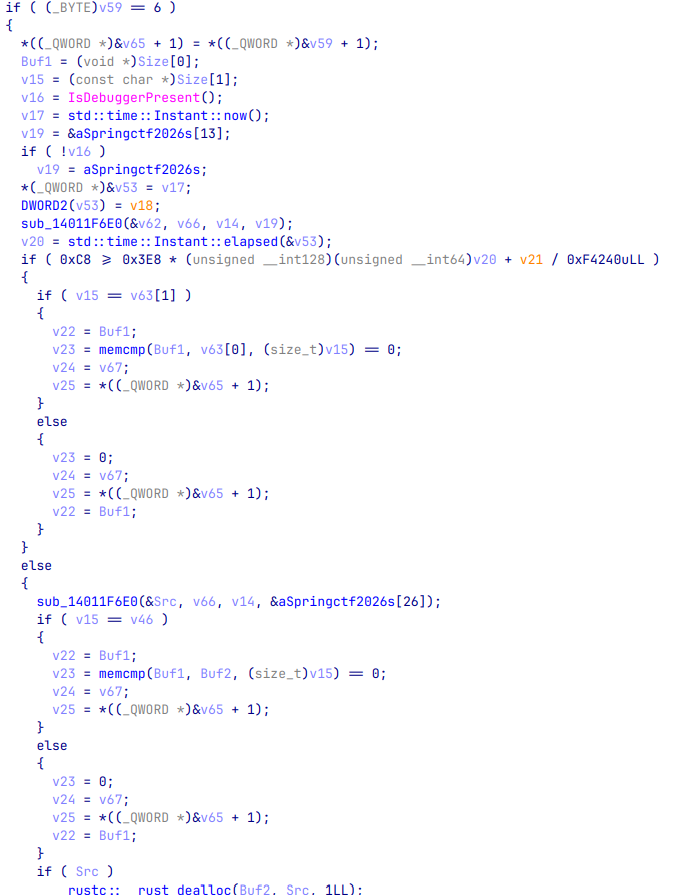

sha256函数，这里被rust编译器优化过了。传入待处理的内容经过sha256之后，哈希结果传递给了v31.m128i_i8

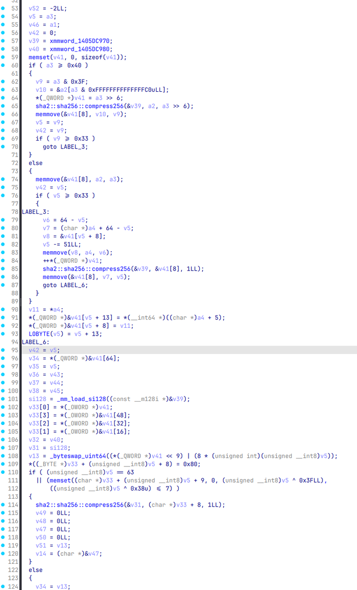

发现一个for循环，循环次数刚好是25次。每次都从哈希结果中取一字节，经过((v31.m128i_i8[i] / 9u) & 0xFC)这个优化后的模运算（本质上等同于byte % 36），最终从字符集a0123456789abcd取一个字符传入v23。

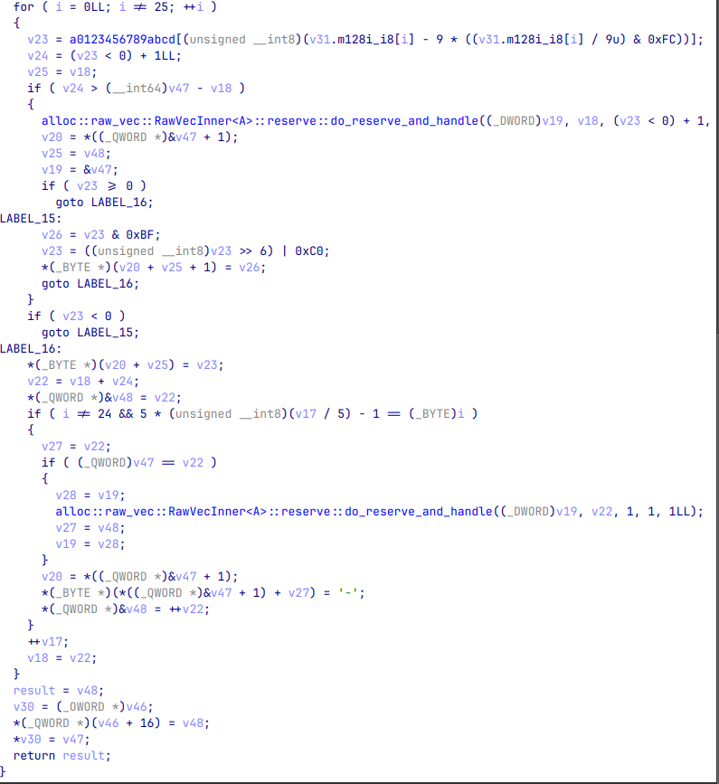
经此分析，我们可以写出注册机：

```python
CHARSET = "0123456789ABCDEFGHIJKLMNOPQRSTUVWXYZ"

def compute_activation_code(input_bytes: bytes, key: bytes) -> str:
    message = input_bytes + key

    sha256 = hashlib.sha256()
    sha256.update(message)
    hash_bytes = sha256.digest()

    output_chars = []
    for i, byte in enumerate(hash_bytes[:25]):
        idx = byte % 36
        output_chars.append(CHARSET[idx])
        if i % 5 == 4 and i != 24:
            output_chars.append('-')
    
    return ''.join(output_chars)

KEY = b"SpringCTF2026"

machine_code = b"00:11:22:33:44:55" # 自己随便编一个mac地址进去就行
code = compute_activation_code(machine_code, KEY)
print(code)
```

参考激活码: 9WKWU-4KBOG-J723X-AXF78-UPR1F


## 核心源码：（依旧rust）

### 客户端
```rust
const CHARSET: &[u8] = b"0123456789ABCDEFGHIJKLMNOPQRSTUVWXYZ";
const SALT_REAL: &str = "SpringCTF2026";
const SALT_TRAP_API: &str = "Spr1ngCTF2O26";
const SALT_TRAP_TIME: &str = "SpringCTF2O26";

#[tauri::command]
fn get_machine_id() -> String {
    match get_mac_address() {
        Ok(Some(mac)) => mac.to_string().to_uppercase(),
        _ => "00:00:00:00:00:00".to_string(),
    }
}

fn generate_code_internal(id: &str, salt: &str) -> String {
    let mut hasher = Sha256::new();
    hasher.update(id.as_bytes());
    hasher.update(salt.as_bytes());
    let result = hasher.finalize();

    let mut code = String::new();
    for i in 0..25 {
        let byte = result[i % result.len()];
        let char_idx = (byte as usize) % CHARSET.len();
        code.push(CHARSET[char_idx] as char);
        if (i + 1) % 5 == 0 && i != 24 {
            code.push('-');
        }
    }
    code
}

#[tauri::command]
fn verify_local(id: String, input_code: String) -> Result<bool, String> {
    let mut current_salt = SALT_REAL;
    unsafe {
        if IsDebuggerPresent().as_bool() {
            current_salt = SALT_TRAP_API;
        }
    }
    let start = Instant::now();
    let expected = generate_code_internal(&id, current_salt);
    
    let mut _dummy = 0;
    for _ in 0..1000 { _dummy += 1; }

    if start.elapsed().as_millis() > TIME_THRESHOLD_MS {
        let trap_expected = generate_code_internal(&id, SALT_TRAP_TIME);
        return Ok(input_code == trap_expected);
    }
    Ok(input_code == expected)
}

#[tauri::command]
async fn verify_remote(server_ip: String, id: String, code: String) -> Result<String, String> {
    let clean_addr = server_ip
        .trim()
        .trim_start_matches("http://")
        .trim_start_matches("https://")
        .trim_end_matches('/');

    let clean_addr = clean_addr.split('/').next().unwrap_or(clean_addr);

    let target_addr = if clean_addr.contains(':') {
        clean_addr.to_string()
    } else {
        format!("{}:80", clean_addr)
    };

    println!("正在连接目标: {}", target_addr);

    let mut stream = TcpStream::connect(&target_addr)
        .map_err(|e| format!("连接服务器失败 ({}): {}", target_addr, e))?;

    let payload = format!("{}|{}", id, code);
    stream.write_all(payload.as_bytes())
        .map_err(|e| format!("发送失败: {}", e))?;

    let mut buffer = [0; 1024];
    let n = stream.read(&mut buffer)
        .map_err(|e| format!("读取响应失败: {}", e))?;

    let response = String::from_utf8_lossy(&buffer[0..n]).to_string();
    
    // 判断 Flag
    if response.contains("Flag:") || response.contains("Spring{") {
        Ok(response)
    } else {
        Err(response)
    }
}
```
### 服务端
```rust
fn generate_real_code(id: &str) -> String {
    let mut hasher = Sha256::new();
    hasher.update(id.as_bytes());
    hasher.update(SALT_REAL.as_bytes());
    let result = hasher.finalize();

    let mut code = String::new();
    for i in 0..25 {
        let byte = result[i % result.len()];
        let char_idx = (byte as usize) % CHARSET.len();
        code.push(CHARSET[char_idx] as char);
        if (i + 1) % 5 == 0 && i != 24 {
            code.push('-');
        }
    }
    code
}

async fn tcp_handler(mut stream: TcpStream) {
    let mut buffer = [0; 1024];

    if let Ok(n) = stream.read(&mut buffer).await {
        let request = String::from_utf8_lossy(&buffer[0..n]);
        let request_line = request.lines().next().unwrap_or("").trim();
        println!("[TCP Logic] Raw Payload: {}", request_line);

        let parts: Vec<&str> = request_line.split('|').collect();
        if parts.len() == 2 {
            let id = parts[0];
            let code = parts[1];
            
            let expected = generate_real_code(id);
            if code == expected {
                let msg = format!("Access Granted. Flag: {}", *FLAG);
                let _ = stream.write_all(msg.as_bytes()).await;
            } else {
                let _ = stream.write_all(b"Verification Failed.").await;
            }
        } else {
            let _ = stream.write_all(b"Invalid Protocol Format").await;
        }
    }
}
```
可以看到所谓机器码，就是获取了一下用户网卡的MAC地址。

激活码过了两遍验证，第一遍是本地验证，这是我们后续逆向分析的关键。

获取完本地地址之后，过了两个反调试判断：第一层，检查是否被调试，如果是，则调用一号假SALT（SALT_TRAP_API）。第二层，检查单步执行时间是否超过阈值时间200ms，如果是，则调用二号假SALT（SALT_TRAP_TIME）。如果都没有，则用真SALT。

在激活码生成函数中，机器码和盐进行了拼接处理（先机器码，后盐）。拼接后进行了一次SHA256。之后从生成的SHA256中提取前25个字节，逐个字节与字符表长度取模作为字符表（CHARSET）索引。字符表有36个字符，所以就是与36模，得到索引值。之后再根据索引值进行拼接，得到激活码，与用户输入的激活码进行本地校验。校验通过后再与用户输入的远程服务器通信，进行远程校验来获取flag。