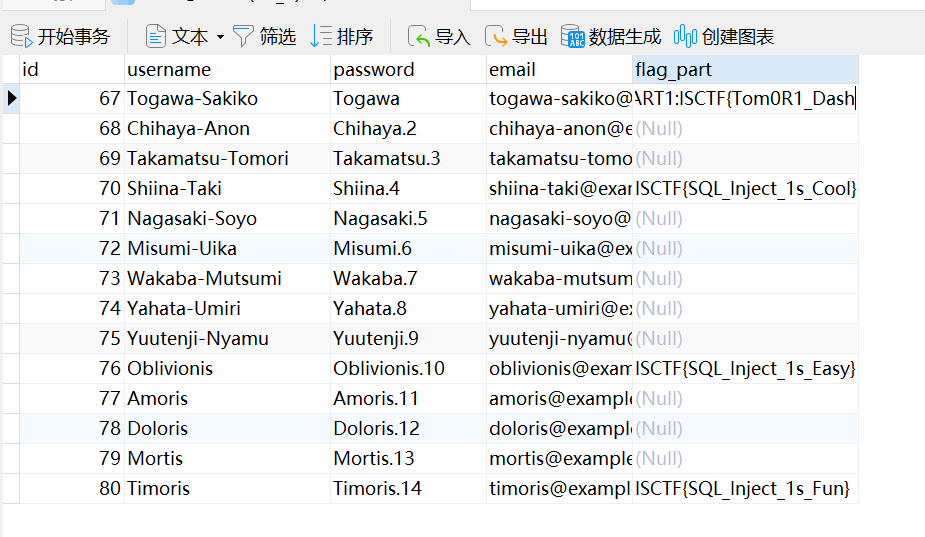
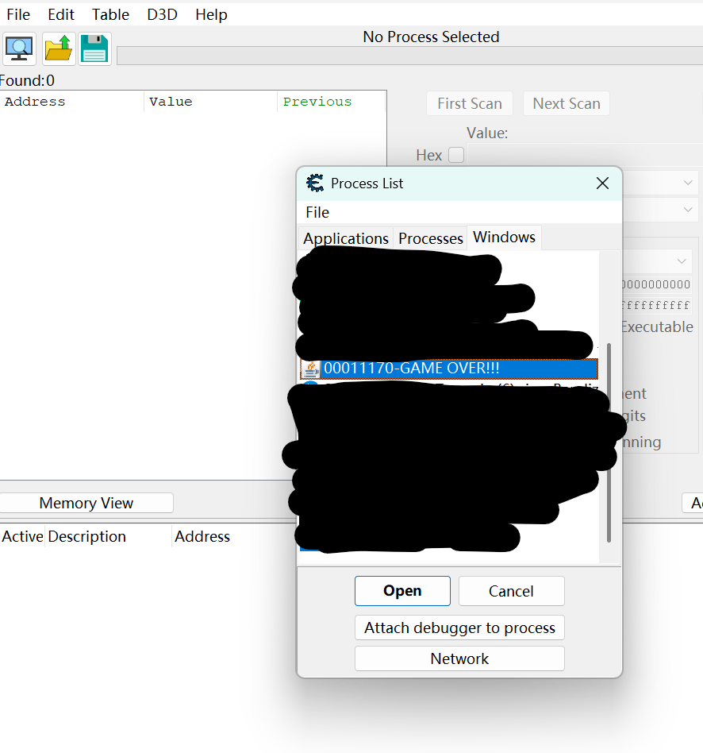
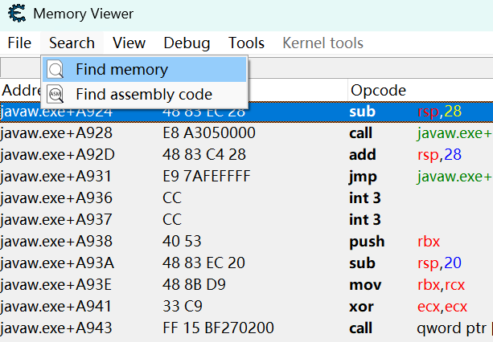
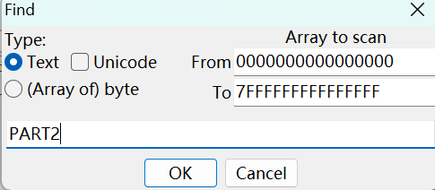
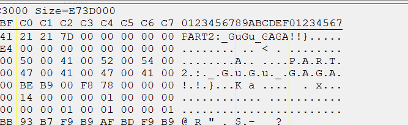
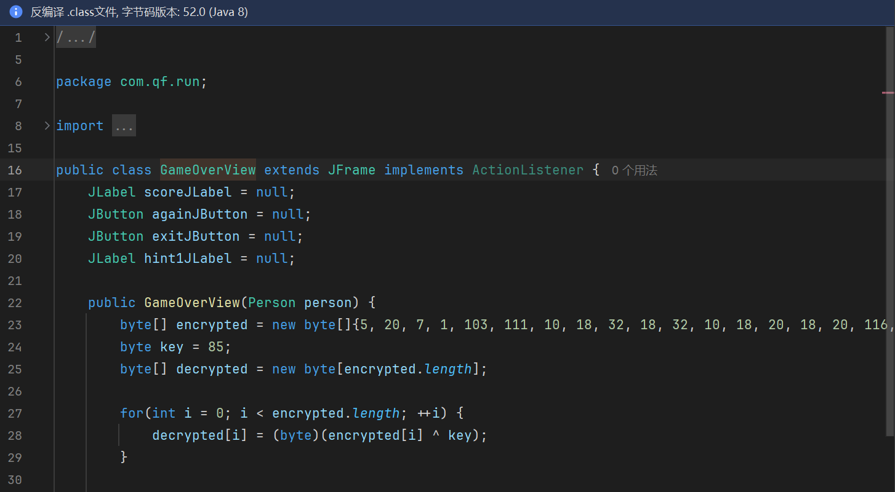
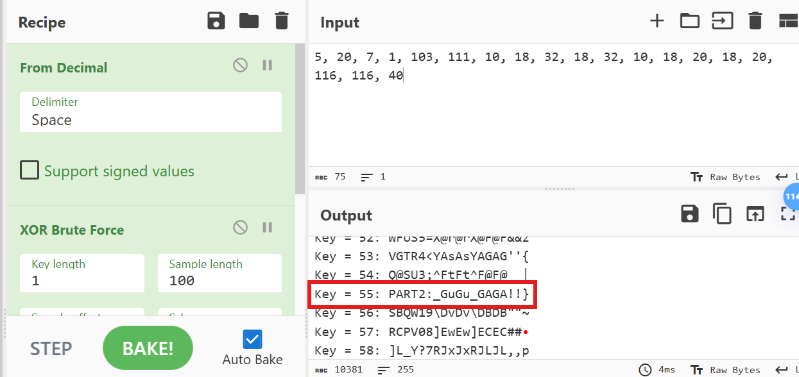
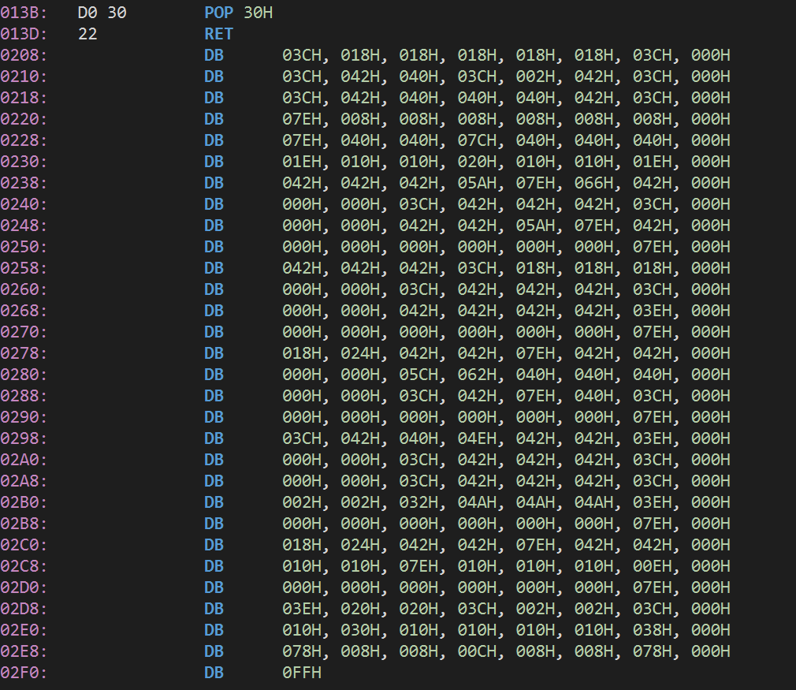
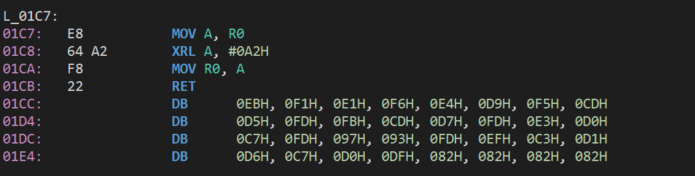
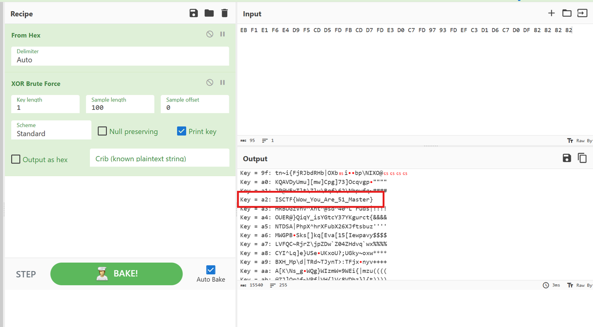

好久没更博客了捏~

前段时间参与了ISCTF 2025的出题喵。

不过是闭着眼出的题，拿自己前段时间的一些作业改出来了三道题目出来。

看评价还可以，偷摸零算是0差评吧，两个单片机总共只有2个差评，感觉已经很不错了捏~

那末，本文就简单概述一下这三道题的Writeup以及出题想法吧。

<!-- more -->

## 冲刺！偷摸零！

Jar包，拿到题目直接解压。  
看到解压出来一个ctf.db，用navicat看一眼。 这里设计这个ctf.db的原因其实是这个实训作业当时用了数据库，，，为了游戏不崩溃所以换成了sqlite3。于是就顺手把flag掰成两段塞里面了一份。  
main-表-user，看到第一行有PART1。



第一段flag就找到了。同时，看到这个形式，猜测第二段flag的开头也是PART，并且是PART2。  
启动游戏，把凑企鹅玩死之后，弹窗提示内存多了什么东西。这里是：诶！☝️🤓

于是：


两种方案：用CE查内存或者直接逆。  
方案1：打开CE，然后打开GAME OVER!!!进程。



用memory view查内存里PART2关键字。





很快就找到了。



两段拼一起就是flag。

方案2：直接逆向法

加密算法并不难，所以逆着也简单。IDEA就能逆，逆向起来很方便。

先把Jar包解压掉，然后找到GameOverView类，点开即送。



这一坨就是密文，一眼异或，直接cyberchef一把梭。



这就出了捏~

ISCTF\{Tom0R1\_Dash\_GuGu\_GAGA!!\}

## 单片机1

#### 解题思路

其实是把flag的字模塞到了程序里。

用工具逆一下，可以发现最底部有大堆的数据。这些就是字模。



写个脚本，把字模渲染出来，就能看到flag了。

#### exp

```python
def visualize_font(asm_data):
    # 1. 解析数据
    byte_list = []
    
    lines = asm_data.strip().split('\n')
    for line in lines:
        if "DB" not in line:
            continue
            
        # 提取 DB 后面的部分: "03CH, 018H..."
        content = line.split("DB")[1]
        
        # 按逗号分割并清理数据
        hex_values = content.split(',')
        for h in hex_values:
            # 去掉空格和结尾的 'H'
            clean_hex = h.strip().replace('H', '')
            if clean_hex:
                byte_list.append(int(clean_hex, 16))

    # 2. 显示字模 (假设是 8x8 点阵，每 8 个字节一个字符)
    bytes_per_char = 8
    total_chars = len(byte_list) // bytes_per_char

    print(f"解析到 {total_chars} 个字符:\n")

    for i in range(total_chars):
        # 获取当前字符的 8 个字节
        char_bytes = byte_list[i*bytes_per_char : (i+1)*bytes_per_char]
        
        print(f"--- 字符 {i+1} (Offset: {i*8}) ---")
        for b in char_bytes:
            # 转为二进制字符串，补足8位
            bits = format(b, '08b')
            # 替换 0 和 1 为更可视化的字符
            visual = bits.replace('0', '  ').replace('1', '██')
            print(f"{visual}  ({hex(b)})")
        print("")

# 你的原始数据
raw_data = """
0208:                DB      03CH, 018H, 018H, 018H, 018H, 018H, 03CH, 000H
0210:                DB      03CH, 042H, 040H, 03CH, 002H, 042H, 03CH, 000H
0218:                DB      03CH, 042H, 040H, 040H, 040H, 042H, 03CH, 000H
0220:                DB      07EH, 008H, 008H, 008H, 008H, 008H, 008H, 000H
0228:                DB      07EH, 040H, 040H, 07CH, 040H, 040H, 040H, 000H
0230:                DB      01EH, 010H, 010H, 020H, 010H, 010H, 01EH, 000H
0238:                DB      042H, 042H, 042H, 05AH, 07EH, 066H, 042H, 000H
0240:                DB      000H, 000H, 03CH, 042H, 042H, 042H, 03CH, 000H
0248:                DB      000H, 000H, 042H, 042H, 05AH, 07EH, 042H, 000H
0250:                DB      000H, 000H, 000H, 000H, 000H, 000H, 07EH, 000H
0258:                DB      042H, 042H, 042H, 03CH, 018H, 018H, 018H, 000H
0260:                DB      000H, 000H, 03CH, 042H, 042H, 042H, 03CH, 000H
0268:                DB      000H, 000H, 042H, 042H, 042H, 042H, 03EH, 000H
0270:                DB      000H, 000H, 000H, 000H, 000H, 000H, 07EH, 000H
0278:                DB      018H, 024H, 042H, 042H, 07EH, 042H, 042H, 000H
0280:                DB      000H, 000H, 05CH, 062H, 040H, 040H, 040H, 000H
0288:                DB      000H, 000H, 03CH, 042H, 07EH, 040H, 03CH, 000H
0290:                DB      000H, 000H, 000H, 000H, 000H, 000H, 07EH, 000H
0298:                DB      03CH, 042H, 040H, 04EH, 042H, 042H, 03EH, 000H
02A0:                DB      000H, 000H, 03CH, 042H, 042H, 042H, 03CH, 000H
02A8:                DB      000H, 000H, 03CH, 042H, 042H, 042H, 03CH, 000H
02B0:                DB      002H, 002H, 032H, 04AH, 04AH, 04AH, 03EH, 000H
02B8:                DB      000H, 000H, 000H, 000H, 000H, 000H, 07EH, 000H
02C0:                DB      018H, 024H, 042H, 042H, 07EH, 042H, 042H, 000H
02C8:                DB      010H, 010H, 07EH, 010H, 010H, 010H, 00EH, 000H
02D0:                DB      000H, 000H, 000H, 000H, 000H, 000H, 07EH, 000H
02D8:                DB      03EH, 020H, 020H, 03CH, 002H, 002H, 03CH, 000H
02E0:                DB      010H, 030H, 010H, 010H, 010H, 010H, 038H, 000H
02E8:                DB      078H, 008H, 008H, 00CH, 008H, 008H, 078H, 000H
"""

if __name__ == "__main__":
    visualize_font(raw_data)
```

## 单片机2

#### 解题思路

1602A屏幕的显示程序，实际1602的DATA引脚要接收的是ASCII码。程序这里只是做了一个简单异或加密。

给的前面大堆反汇编出来的汇编源码和NOTE.txt其实都没什么用。真正有用的内容还是最后那一部分。



密文和解密逻辑都在这了，直接解。



其实这题是我1602的作业改的，，，专门加了一个解密逻辑进去喵~
