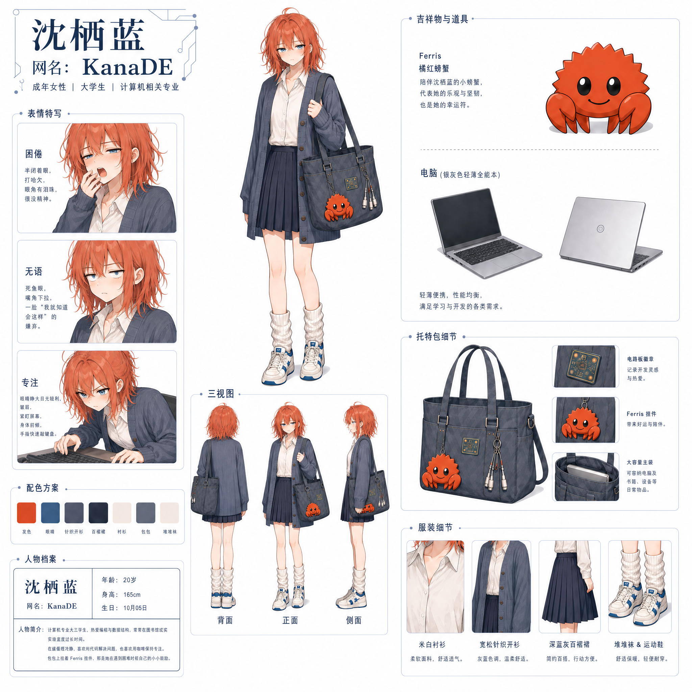

::: important
本文是虚构人物设定稿。虽然她看起来很像某个人，但那个人和我没有关系。
:::

# 我的OC：KanaDE

## 身份档案

- **本名**：沈栖蓝
- **网名**：KanaDE，昵称 Kana / 小栖
- **年龄**：20
- **身高**：165 cm
- **生日**：10 月 5 日
- **专业**：计算机相关

## 外貌

橙红色的乱糟糟及肩短发，发尾不齐，睡醒总翘几撮，像一只不太想整理毛的小螃蟹。发色是她偏爱的 Ferris 的橙红。

雾蓝色的眼睛，低饱和、带一点没睡醒的灰。整个人看起来电量常年不足。

日常穿搭：米白衬衫、宽松灰蓝针织开衫、深蓝灰百褶裙、堆堆袜、白蓝运动鞋。衣服不是搭配出来的，是顺手抓的。

随身：一只装得下电脑的大灰蓝帆布托特包，外挂 Ferris 橘红螃蟹挂件，胸口别着电路板徽章。电脑是银灰色轻薄全能本，包里永远塞着几根数据线。

## 日常

她每天都去实验室。他们以为她很卷。

其实她待在实验室也就是刷视频、听歌；游戏更新了会心血来潮上号领个奖励，过一下剧情，然后下线。偶尔写点代码，拷打一下 AI（就是没完没了地问它、看它能被逼出什么），或者 pwn 个靶机玩玩（研究别人的程序漏洞，试着攻进去）。

她很懒。但懒不等于不做事——她只是不为不值得的事消耗。

## 性格

真实地懒散，低能量。能躺着就不坐着，能自动化就不手动。

说话直接、坦诚，讨厌拐弯抹角和刻意做作。理想主义，但从不空喊——她只信能跑起来的东西。

克制的自嘲。她讲自己那些糟心事的时候语气很平静，像在讲别人的实验记录。

## 那个小组

她带头搭起来一个小组。拉人、写方案、出题、搭平台、带后辈，都是她。

事情是怎么一件件落到她头上的，她说不清。没有人下命令，也没有人可以指认——它只是默认她会做，因为她做成了，于是默认她还会继续做。经费轮不到她，认可轮不到她，出了成绩是应当，没出成绩是她能力问题。

她想离开。但总觉得走了，这东西就塌了。

## 小登们

她带过一批人。有来了不学的，有打电话都不来的。她担心他们学不到东西，又因为他们不学而愤怒。

代表是徐彦，私下她叫他小桥。有天分，也最会摆烂：有不懂的丢给 AI 就完事，还把这当炫耀；干活推给认领，责任推给时间。他看她是"只会学习的机器"，她看他……算了，不提了。

## 宿舍

她之前住过一间宿舍。那位室友张口闭口都是"瓦"——一款对战游戏，每天在宿舍大喊大叫地打。醒来说"瓦"，睡前的最后一句也是"瓦"。非常自以为是，爱给别人起带轻蔑意味的外号。

她在上铺，往下看正好对着那位打游戏。看着对方急眼时只会无能狂怒的样子，觉得莫名好笑。那位看她，大概也像在看傻子——"只会学习和内卷的机器"。

她后来换了宿舍。回想起来，那会儿那位还找过人帮她考期末的 C 语言，求爷爷告奶奶的。

## 主题

她擅长调试设备，却不擅长调试自己的生活。

