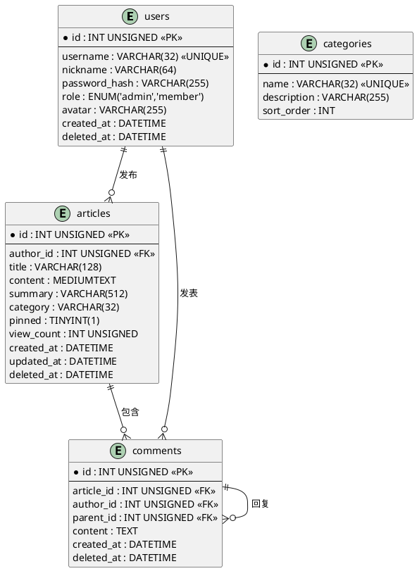

## 项目概述

SLsec 实验室论坛是本课设的核心项目，采用 **Client-Server** 架构：

- **Server**：Rust + axum + sqlx，提供 HTTP REST API 和 WebSocket 推送
- **Client**：Rust + ratatui，纯终端 TUI 界面，支持鼠标和键盘快捷键
- **数据库**：MySQL 8.0，通过 Docker 部署

项目路径：`~/db_class_design_rs/`（Cargo workspace，包含 `server` 和 `client` 两个 crate）

## ER 图



## 建表 SQL

完整脚本位于 `server/sql/init.sql`，核心设计要点：

**软删除**：`users`、`articles`、`comments` 均有 `deleted_at` 字段，删除时只设置时间戳而不物理删除，保留数据完整性。

**索引策略**：

| 表 | 索引 | 用途 |
|---|---|---|
| users | `username` UNIQUE | 登录查询 |
| articles | `author_id` | 按作者筛选 |
| articles | `created_at DESC` | 时间倒序列表 |
| articles | `category` | 分类筛选 |
| comments | `article_id` | 文章评论列表 |

**字符集**：全库 `utf8mb4 + utf8mb4_unicode_ci`，支持 emoji。

## 数据模型（Rust）

`server/src/models.rs` 中用 `sqlx::FromRow` 宏自动映射查询结果：

```rust
#[derive(Debug, Clone, Serialize, Deserialize, FromRow)]
pub struct User {
    pub id: u32,
    pub username: String,
    pub nickname: String,
    #[serde(skip_serializing)]  // 密码哈希不序列化到 JSON
    pub password_hash: String,
    pub role: String,
    pub avatar: Option<String>,
    pub created_at: NaiveDateTime,
    pub deleted_at: Option<NaiveDateTime>,
}
```

JOIN 查询结果用独立的 `ArticleJoinRow` 结构体接收，避免与基础模型混用：

```rust
#[derive(FromRow)]
struct ArticleJoinRow {
    // articles 字段 + JOIN 来的 author_name, author_nickname, comment_count
}
```

## 数据库初始化流程

Server 启动时自动执行 `init_db()`：

1. 先连接 `mysql` 系统库，执行 `CREATE DATABASE IF NOT EXISTS slsec_forum`
2. 重新连接 `slsec_forum`，执行 `init.sql` 中的建表语句
3. `INSERT IGNORE` 插入默认管理员账号（`admin` / `admin123`）和分类数据

这样做的好处是**零配置启动**——只要 MySQL 在线，第一次运行就能自动建库建表。
