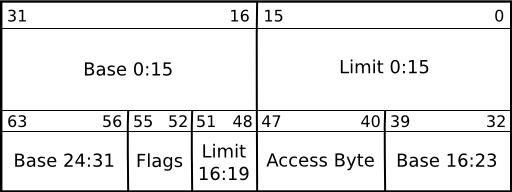

## 绪

或许我们早已习惯了标准库带来的便利。但在面对裸机时，标准库也烟消云散了。不过，我们的伟大征程也将从此开始。我们将卸下标准库这个繁重的镣铐，领略系统级编程语言的魅力时刻。让指针在内存空间中轻舞，让字节在代码间流转。是时候该启程了。

不要因为走得太远，而忘记当初为什么出发。在这一幕中，我们将离开操作系统的舒适区，让我们的代码直面冰冷的硬件。在这里，没有printf，没有puts，也没有putchar和write函数，有的只是对framebuffer这条线性帧缓冲区的操作。

不过，我们做一下长远规划：我们要有一个主控制台，还要有操作系统最基础的内存管理、进程管理等库，以及GDT、IDT管理、中断服务函数等。
<!-- more -->

为了方便管理项目，我们进行一下项目分区。按照上面提到的内容，为它们创建一下文件夹。为了节省时间，我们先创建现在有的和这一章需要的即可。

Limine已经为我们实现了memcpy、memset、memmove和memcmp这些基础内存操作函数，存放在memory.c和.h文件中。我们把这两个文件移动到memory/下。

main.c中有一些Limine预先设定的request和response，我们把它们提取出来，放到limine/下，并把static去掉以便其他模块也能访问。

为了让我们的内核尽可能地“标准”，我们需要定义GDT（全局描述符表）和IDT（终端描述符表），并放一些ISR给IDT，便于CPU在遇到异常或者中断时进行处理。

## GDT——全局描述符表
GDT在x86-64下，其实算是一个“屎山代码”，因为GDT在x86-64下几乎没有任何作用了。但为了兼容性考虑，我们还是需要初始化它。所以，我们还是需要老老实实写一个GDT初始化模块——为了后续的IDT、中断处理以及未来切换到Ring3做准备。

一个标准的GDT如这个表所示：

所以我们首先要做的就是：按照这个表，定义一个GDT结构体。我们把这部分内容写进gdt.h中。

```C
#ifndef __GDT_H
#define __GDT_H

#include <stdint.h>

struct gdt_entry {
  uint16_t limit_low;
  uint16_t base_low;
  uint8_t base_middle;
  uint8_t access;
  uint8_t granularity;
  uint8_t base_high;
} __attribute__((packed));

struct gdt_ptr {
  uint16_t limit;
  uint64_t base;
} __attribute__((packed));

void gdt_init();

#endif

```
定义完GDT，接下来我们需要实现GDT的初始化以及装载。我们把这部分内容写入gdt.c中。
```C
#include "gdt.h"

struct gdt_entry gdt[3];
struct gdt_ptr gdtr;

void load_gdt(uint64_t gdtr);

void gdt_set_gate(int num, uint64_t base, uint64_t limit, uint8_t access,
                  uint8_t gran) {
  gdt[num].base_low = (base & 0xFFFF);
  gdt[num].base_middle = (base >> 16) & 0xFF;
  gdt[num].base_high = (base >> 24) & 0xFF;
  gdt[num].limit_low = limit & 0xFFFF;
  gdt[num].granularity = (limit >> 16) & 0x0F;
  gdt[num].granularity |= gran & 0xF0;
  gdt[num].access = access;
}

void gdt_init() {
  gdt_set_gate(0, 0, 0, 0, 0);
  gdt_set_gate(1, 0, 0xFFFFFFFF, 0x9A, 0xAF);
  gdt_set_gate(2, 0, 0xFFFFFFFF, 0x92, 0x00);

  gdtr.limit = (sizeof(struct gdt_entry) * 3) - 1;
  gdtr.base = (uint64_t)&gdt;
  load_gdt((uint64_t)&gdtr);
}

```
x86-64 CPU有一个专门加载GDT的指令，就是lgdt（Load GDT）。它需要传入GDT的地址。但是受限于C语言环境，加载GDT的函数我们使用汇编来实现。
因此我们需要在gdt.c中声明一个load_gdt(uint64_t gdtr)函数，并把这个函数的具体实现代码写入load_gdt.asm中，再将它global出来以便我们的C代码调用。

```assembly
global load_gdt

load_gdt:
  lgdt [rdi]

  mov ax, 0x10
  mov ds, ax
  mov es, ax
  mov fs, ax
  mov gs, ax
  mov ss, ax


  pop rdi
  mov rax, 0x08
  push rax
  push rdi
  retfq

```

